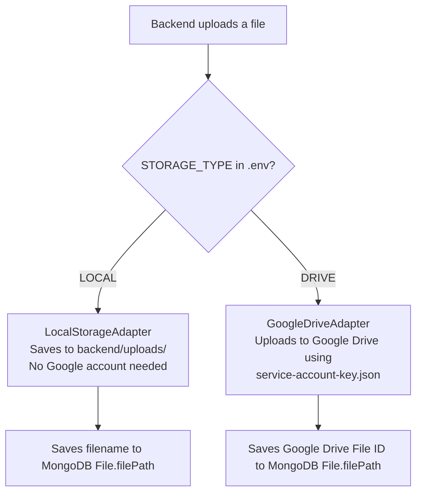

# Google Drive Storage — Setup Guide

> **For beginners:** This guide explains how to connect the app to Google Drive for cloud file storage. If you just want to run the app locally, you can **skip this entirely** by using `STORAGE_TYPE=LOCAL` in your `.env`.

---

## When Do You Need This?

| Scenario                        | Do You Need This Guide?             |
| ------------------------------- | ----------------------------------- |
| Local development / testing     | ❌ Use `STORAGE_TYPE=LOCAL` instead |
| Running a shared staging server | ✅ Yes                              |
| Production deployment           | ✅ Yes                              |

---

## How the Storage System Works



---

## Step 1 — Create a Google Cloud Project

1. Go to [Google Cloud Console](https://console.cloud.google.com/)
2. Click **"New Project"** at the top
3. Name it something like `aus-intranet-storage` and click **Create**

---

## Step 2 — Enable the Google Drive API

1. Inside your project, go to **APIs & Services → Library**
2. Search for **"Google Drive API"**
3. Click it, then click **Enable**

---

## Step 3 — Create a Service Account

A Service Account is like a robot user — the app uses it to upload files to Drive without needing a human to log in.

1. Go to **APIs & Services → Credentials**
2. Click **Create Credentials → Service account**
3. Give it a name (e.g. `intranet-drive-bot`) and click **Done**

---

## Step 4 — Download the Service Account Key

1. Click the service account you just created
2. Go to the **Keys** tab
3. Click **Add Key → Create new key**
4. Choose **JSON** format → Click **Create**
5. A `.json` file will download automatically

---

## Step 5 — Place the Key File

Rename the downloaded file to `service-account-key.json` and place it in:

```
backend/
└── service-account-key.json   ← place here
```

> [!CAUTION]
> This file contains secret credentials. It is listed in `.gitignore` — **never commit it to Git**.

---

## Step 6 — Create a Shared Drive Folder

The service account needs a folder to upload files into.

1. Open [Google Drive](https://drive.google.com)
2. Create a new folder (e.g. `AUS Intranet Files`)
3. Right-click the folder → **Share**
4. Paste the service account's email (looks like `intranet-drive-bot@your-project.iam.gserviceaccount.com`) — found in the JSON file under `"client_email"`
5. Set permission to **Editor** → Click **Share**

---

## Step 7 — Update Your `.env`

```env
STORAGE_TYPE=DRIVE
GOOGLE_SERVICE_ACCOUNT_KEY_PATH=./service-account-key.json
```

> [!NOTE]
> The exact variable names may vary depending on how `GoogleDriveAdapter.js` reads them. Check `backend/adapters/GoogleDriveAdapter.js` for the exact `process.env` keys used.

---

## Step 8 — Verify

Start the backend and upload any file through the app. Then check your Google Drive folder — the file should appear there.

---

## Troubleshooting

| Symptom                                   | Cause                                    | Fix                                                      |
| ----------------------------------------- | ---------------------------------------- | -------------------------------------------------------- |
| `Error: ENOENT: service-account-key.json` | File not in `backend/` directory         | Move the JSON file to `backend/`                         |
| `403: Forbidden` from Google Drive        | Service account not shared on the folder | Re-share the Drive folder with the service account email |
| Files save locally instead of Drive       | `STORAGE_TYPE` not set to `DRIVE`        | Check your `backend/.env` value                          |
