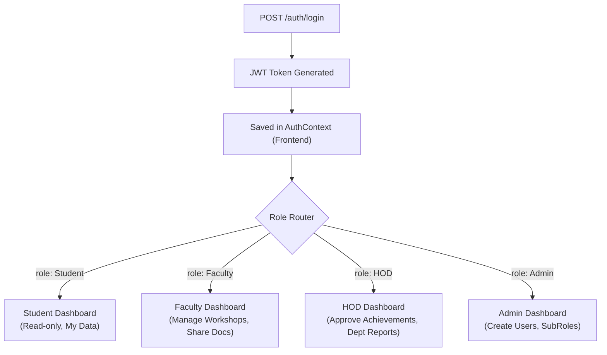
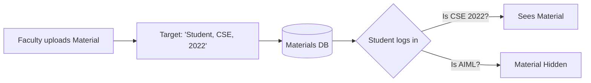
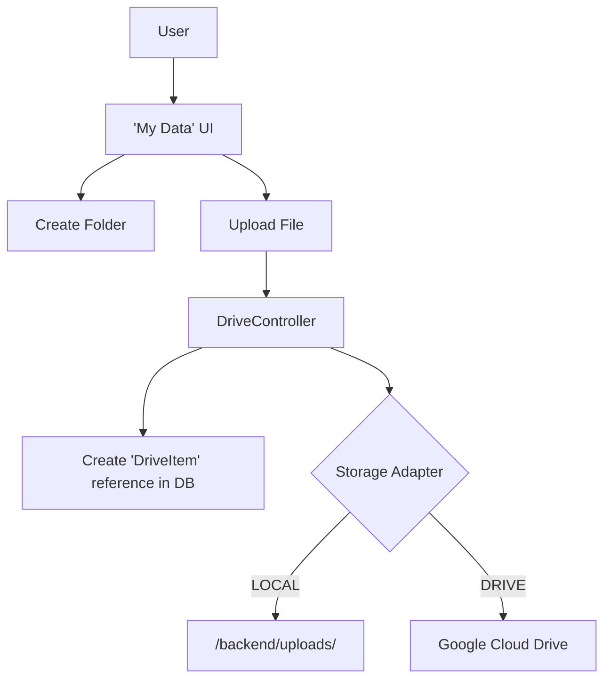
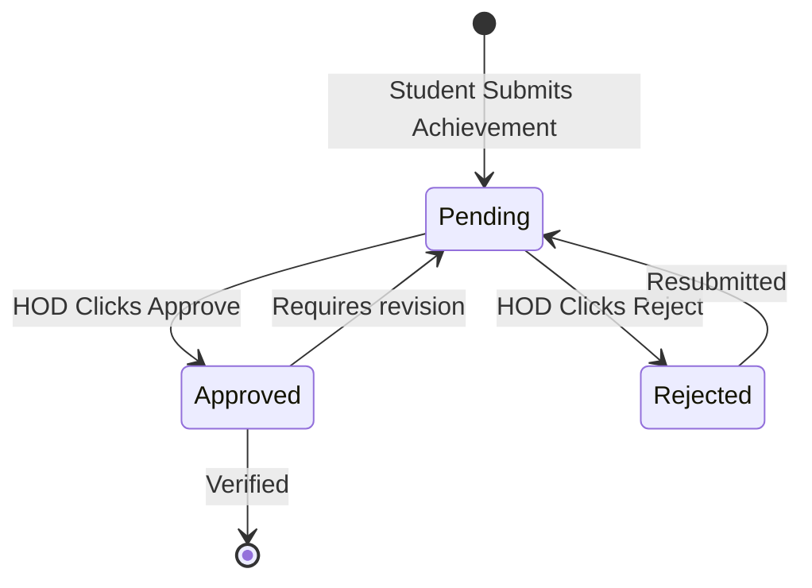

# Project Overview & Architecture

> **Welcome to the Aditya University Intranet Portal.** This document provides a bird's-eye view of the entire MERN stack architecture, the folder structure, and how the core modules interact. If you are a beginner, read this before diving into the code.

---

## 📂 Complete Folder Structure

The project is split into two main directories: `backend` (Express.js) and `frontend` (React Frontend).

### Backend Structure (`/backend`)

```text
backend/
├── adapters/                  # Pattern: Adapters (e.g. GoogleDriveAdapter.js)
├── controllers/               # Route handlers (Auth, Drive, Announcements)
├── factories/                 # Pattern: Factories (UserFactory.js)
├── middleware/                # Express Middlewares (authMiddleware, roleMiddleware)
├── models/                    # Mongoose Data Schemas (User, File, DriveItem)
├── routes/                    # API Endpoints mapped to controllers
├── scripts/                   # Utility scripts (db-sync, backup)
├── services/                  # Business logic (AuthService, DriveService)
├── strategies/                # Pattern: Strategies (AnnouncementContext)
├── .env                       # Local environment variables (NOT IN GIT)
└── server.js                  # Entry point for the Node.js application
```

### Frontend Structure (`/frontend`)

```text
frontend/
├── src/
│   ├── assets/
│   │   ├── components/
│   │   │   ├── app/            # Main app shell & routing
│   │   │   ├── common/         # Reusable UI (Buttons, Modals, Spinners)
│   │   │   ├── dashboards/     # Role-specific views (Student, HOD, Admin)
│   │   │   ├── features/       # Module views (Announcements, Workshops, Drive)
│   │   │   └── forms/          # Reusable form components
│   │   └── css/                # Global styles
│   ├── contexts/               # React Context (AuthContext)
│   ├── hooks/                  # Custom React hooks
│   ├── utils/                  # Helpers (api.js, role-checks.js)
│   ├── App.jsx                 # Top-level React component
│   └── main.jsx                # React DOM render entry
├── vite.config.js              # Vite bundler configuration
└── package.json                # Frontend dependencies
```

---

## 🧩 Core Modules & Flowcharts

The system is composed of several independent but connected modules.

### 1. Unified Authentication & Role System

Every user logs in through a single portal. Their `role` and `subRole` (department) dynamically determine what they can see and do.



### 2. Content Sharing & Announcements

Faculty and HODs can broadcast messages or share files. The **Strategy Pattern** is used to figure out exactly who sees what based on their dept/batch.



### 3. Personal Drive (My Data)

A Google Drive-like virtual file system built right into the app.



### 4. Achievement & Workshop Life-cycle

A multi-stage approval system for tracking academic success and training.



---

## 🚀 Where to go next?

1. Need to spin up the app on your laptop? Head to **[Local Env Setup](./local-env-setup.md)**.
2. Looking for all the API endpoints? Head to the **`03-api-contracts/`** folder.
3. Want to understand the database tables? Read **[Database Models](../02-architecture-system-design/database-and-models.md)**.
