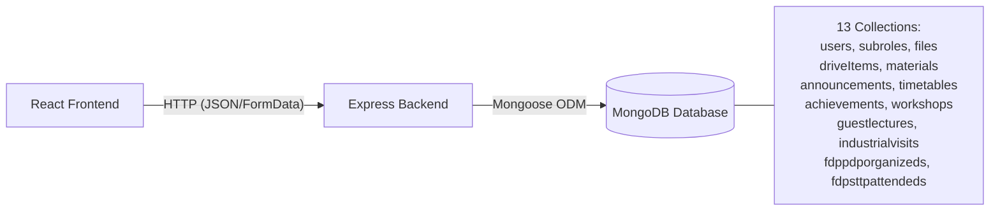
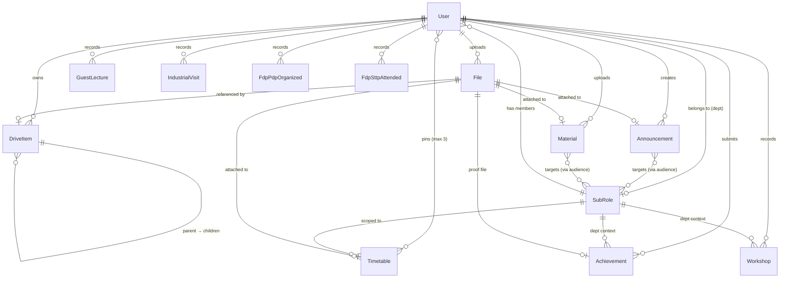

# Database Architecture & Mongoose Schemas

> **For beginners:** This document describes how data is structured in the MongoDB database. Think of each section below as a "table" (called a _collection_ in MongoDB) with its columns (called _fields_).

---

## How the Database Fits in the System

---

## Entity-Relationship Overview

---

## Collection Details

---

### 1. `users` — `models/User.js`

The central identity model. Every authenticated action traces back to a User.

| Field                                    | Type                     | Required      | Notes                                                                                                 |
| ---------------------------------------- | ------------------------ | ------------- | ----------------------------------------------------------------------------------------------------- |
| `username`                               | String                   | ✅            | Display name (e.g. `"Veeranna Reddy"`)                                                                |
| `id`                                     | String (unique)          | ✅            | Login ID — roll number for students, employee ID for staff. **Case-insensitive lookup.**              |
| `password`                               | String                   | ✅            | ⚠️ Currently plain text. See [Known Issues KI-001](../06-troubleshooting-and-lessons/known-issues.md) |
| `role`                                   | String (enum)            | ✅            | One of: `Student`, `Officers`, `Dean`, `Asso.Dean`, `HOD`, `Faculty`, `Admin`                         |
| `subRole`                                | ObjectId → `SubRole`     | Conditional   | Department reference. Required for all roles except `Admin`. `null` for Admin.                        |
| `batch`                                  | String                   | Students only | Academic batch e.g. `"2022-2026"`                                                                     |
| `canUploadTimetable`                     | Boolean                  | —             | Faculty-only permission flag. Default `false`.                                                        |
| `permissions.approveStudentAchievements` | Boolean                  | —             | Can approve student achievement submissions                                                           |
| `permissions.approveFacultyAchievements` | Boolean                  | —             | Can approve faculty achievement submissions                                                           |
| `permissions.canManageWorkshops`         | Boolean                  | —             | Can add/edit workshop records                                                                         |
| `permissions.canManageGuestLectures`     | Boolean                  | —             | Can add/edit guest lecture records                                                                    |
| `permissions.canManageIndustrialVisits`  | Boolean                  | —             | Can add/edit industrial visit records                                                                 |
| `permissions.canManageFdpPdp`            | Boolean                  | —             | Can add/edit FDP/PDP records                                                                          |
| `permissions.canManageFdpSttp`           | Boolean                  | —             | Can add/edit FDP/STTP (Outside) records                                                               |
| `pinnedTimetables`                       | [ObjectId → `Timetable`] | —             | Up to 3 pinned timetable shortcuts                                                                    |

---

### 2. `subroles` — `models/SubRole.js`

Departments and organizational units. The bridge for all department-scoped operations.

| Field          | Type                       | Required | Notes                                                      |
| -------------- | -------------------------- | -------- | ---------------------------------------------------------- |
| `name`         | String                     | ✅       | Full department name: `"Computer Science and Engineering"` |
| `code`         | String (unique, uppercase) | ✅       | Short lookup key: `"CSE"`, `"AIML"`, `"REG"`               |
| `displayName`  | String                     | ✅       | UI-friendly label: `"CSE"`                                 |
| `allowedRoles` | [String]                   | —        | Which roles can be registered in this dept                 |

---

### 3. `files` — `models/File.js`

> [!IMPORTANT]
> This is the **most important model to understand.** Every uploaded file across every feature (timetable, material, announcement, achievement, drive) creates one `File` document. It is the single source of truth for physical file storage. See [ADR-0003](../05-decisions-and-adrs/0003-unified-file-model.md) for the design rationale.

| Field                  | Type              | Required | Notes                                                                                                                                                          |
| ---------------------- | ----------------- | -------- | -------------------------------------------------------------------------------------------------------------------------------------------------------------- |
| `fileName`             | String            | ✅       | Original filename e.g. `"schedule.pdf"`                                                                                                                        |
| `filePath`             | String (unique)   | ✅       | Storage pointer — a Google Drive File ID (`"1abc..."`) when using cloud, or the timestamped filename (`"1709123456789_schedule.pdf"`) when using local storage |
| `fileType`             | String            | —        | MIME type e.g. `"application/pdf"`, `"image/jpeg"`                                                                                                             |
| `fileSize`             | Number            | —        | Size in bytes                                                                                                                                                  |
| `uploadedBy`           | ObjectId → `User` | ✅       | Who uploaded it                                                                                                                                                |
| `usage.isPersonal`     | Boolean           | —        | `true` = linked to a DriveItem (personal drive file)                                                                                                           |
| `usage.isAnnouncement` | Boolean           | —        | `true` = linked to an Announcement attachment                                                                                                                  |
| `usage.isAchievement`  | Boolean           | —        | `true` = linked to an Achievement proof                                                                                                                        |
| `usage.isDeptDocument` | Boolean           | —        | `true` = linked to a Material or Timetable                                                                                                                     |
| `uploadedAt`           | Date              | —        | Auto-set on creation                                                                                                                                           |

---

### 4. `driveitems` — `models/DriveItem.js`

The virtual folder/file tree for each user's "My Data" space.

| Field       | Type                   | Required | Notes                                                              |
| ----------- | ---------------------- | -------- | ------------------------------------------------------------------ |
| `name`      | String                 | ✅       | Display name (shown in UI)                                         |
| `type`      | String (enum)          | ✅       | `"folder"` or `"file"`                                             |
| `parent`    | ObjectId → `DriveItem` | —        | Parent folder's ID. `null` = root level item.                      |
| `owner`     | ObjectId → `User`      | ✅       | The user this item belongs to                                      |
| `fileId`    | ObjectId → `File`      | —        | Only set when `type = "file"`. Points to the physical file record. |
| `createdAt` | Date                   | —        | Auto-set                                                           |
| `updatedAt` | Date                   | —        | Auto-updated via `pre('save')` hook                                |

---

### 5. `announcements` — `models/Announcement.js`

System-wide or targeted broadcast messages.

| Field            | Type              | Required | Notes                                                                                                         |
| ---------------- | ----------------- | -------- | ------------------------------------------------------------------------------------------------------------- |
| `title`          | String            | ✅       | Announcement heading                                                                                          |
| `description`    | String            | ✅       | Message body                                                                                                  |
| `fileId`         | ObjectId → `File` | —        | Optional attachment                                                                                           |
| `uploadedBy`     | ObjectId → `User` | ✅       | Author                                                                                                        |
| `uploadedAt`     | Date              | —        | Auto-set                                                                                                      |
| `targetAudience` | Array of rules    | —        | Each rule: `{ role: String, subRole: ObjectId\|null, batch: String\|null }`. An empty array = visible to all. |

---

### 6. `materials` — `models/Material.js`

Shared academic documents (lecture notes, assignments, etc.)

| Field                 | Type              | Required | Notes                                                 |
| --------------------- | ----------------- | -------- | ----------------------------------------------------- |
| `title`               | String            | ✅       | Document title                                        |
| `subject`             | String            | ✅       | Course/subject name                                   |
| `targetAudience`      | Array of rules    | —        | Same format as Announcement's `targetAudience`        |
| `targetIndividualIds` | [String]          | —        | Specific user IDs who can always see this material    |
| `hiddenFor`           | [String]          | —        | User IDs who have soft-deleted (hidden) this material |
| `fileId`              | ObjectId → `File` | ✅       | The physical document                                 |
| `uploadedBy`          | ObjectId → `User` | ✅       | Who shared it                                         |

---

### 7. `timetables` — `models/Timetable.js`

Department timetable PDFs. Uniqueness enforced per `SubRole + targetYear + targetSection`.

| Field           | Type                 | Required | Notes                                      |
| --------------- | -------------------- | -------- | ------------------------------------------ |
| `targetYear`    | Number               | ✅       | Academic year (e.g. `2` = second year)     |
| `targetSection` | Number               | ✅       | Section number (e.g. `1`)                  |
| `subRole`       | ObjectId → `SubRole` | ✅       | Which department this timetable belongs to |
| `batch`         | String               | —        | Optional batch filter                      |
| `fileId`        | ObjectId → `File`    | ✅       | The PDF file                               |
| `uploadedBy`    | ObjectId → `User`    | ✅       | Who uploaded it                            |

---

### 8. `achievements` — `models/Achievement.js`

Student and faculty achievements with a 3-stage approval workflow: **Pending → Approved/Rejected**.

| Field            | Type                 | Notes                                                                                                         |
| ---------------- | -------------------- | ------------------------------------------------------------------------------------------------------------- |
| `type`           | String               | Category: `"Certification"`, `"Placement"`, `"Competition"`, `"Research Paper"`, etc.                         |
| `status`         | String (enum)        | `"Pending"`, `"Approved"`, `"Rejected"`                                                                       |
| `userId`         | String               | Submitter's login ID (e.g. `"22CS001"`)                                                                       |
| `userName`       | String               | Snapshot of submitter's name at time of submission                                                            |
| `userRole`       | String               | `"Student"` or `"Faculty"`                                                                                    |
| `dept`           | ObjectId → `SubRole` | Department context for the achievement                                                                        |
| `proofFileId`    | ObjectId → `File`    | Certificate or proof document                                                                                 |
| `approvedBy`     | String               | Approver's display name (snapshotted)                                                                         |
| `approverId`     | String               | Approver's login ID                                                                                           |
| `approverRole`   | String               | Approver's role at time of approval                                                                           |
| _Dynamic fields_ | Varies               | Type-specific fields: `certificationName`, `companyName`, `journalName`, `eventName`, `rank`, `package`, etc. |

---

### 9. `workshops` — `models/Workshop.js`

Faculty training/workshop records tied to a department.

| Field                   | Type                 | Required | Notes                           |
| ----------------------- | -------------------- | -------- | ------------------------------- |
| `userId`                | String               | ✅       | Faculty's login ID              |
| `dept`                  | ObjectId → `SubRole` | ✅       | Department reference            |
| `academicYear`          | String               | ✅       | e.g. `"2024-2025"`              |
| `activityName`          | String               | ✅       | Name of the workshop/event      |
| `startDate` / `endDate` | Date                 | ✅       | Duration                        |
| `resourcePerson`        | String               | ✅       | Speaker / resource person name  |
| `professionalBody`      | String               | —        | Organizing body (e.g. `"IEEE"`) |
| `studentCount`          | Number               | ✅       | Number of students who attended |
| `contactHours`          | Number               | —        | Total hours of the program      |

---

### 10. `guestlectures` — `models/GuestLecture.js`

Faculty guest lecture records tied to a department.

| Field                   | Type                 | Required | Notes                           |
| ----------------------- | -------------------- | -------- | ------------------------------- |
| `userId`                | String               | ✅       | Faculty's login ID              |
| `dept`                  | ObjectId → `SubRole` | ✅       | Department reference            |
| `academicYear`          | String               | ✅       | e.g. `"2024-2025"`              |
| `topic`                 | String               | ✅       | Topic of the lecture            |
| `startDate` / `endDate` | Date                 | ✅       | Duration                        |
| `resourcePerson`        | String               | ✅       | Speaker name                    |
| `studentCount`          | Number               | ✅       | Number of attendees             |

---

### 11. `industrialvisits` — `models/IndustrialVisit.js`

Industrial visit records tied to a department.

| Field                   | Type                 | Required | Notes                           |
| ----------------------- | -------------------- | -------- | ------------------------------- |
| `userId`                | String               | ✅       | Faculty's login ID              |
| `dept`                  | ObjectId → `SubRole` | ✅       | Department reference            |
| `academicYear`          | String               | ✅       | e.g. `"2024-2025"`              |
| `industryName`          | String               | ✅       | Name of visited industry        |
| `startDate` / `endDate` | Date                 | ✅       | Duration                        |
| `studentCount`          | Number               | ✅       | Number of attendees             |
| `facultyCount`          | Number               | ✅       | Participating faculty           |
| `outcome`               | String               | ✅       | Visit outcome summary           |

---

### 12. `fdppdporganizeds` — `models/FdpPdpOrganized.js`

FDP/PDP records organized by the department.

| Field                   | Type                 | Required | Notes                           |
| ----------------------- | -------------------- | -------- | ------------------------------- |
| `userId`                | String               | ✅       | Faculty's login ID              |
| `dept`                  | ObjectId → `SubRole` | ✅       | Department reference            |
| `academicYear`          | String               | ✅       | e.g. `"2024-2025"`              |
| `nameOfProgram`         | String               | ✅       | Name of FDP/PDP                 |
| `startDate` / `endDate` | Date                 | ✅       | Duration                        |
| `facultyCount`          | Number               | ✅       | Number of attendees             |
| `sourceOfFunding`       | String               | ✅       | Funding agency/source           |

---

### 13. `fdpsttpattendeds` — `models/FdpSttpAttended.js`

FDP/STTP (Outside) attended records.

| Field                   | Type                 | Required | Notes                           |
| ----------------------- | -------------------- | -------- | ------------------------------- |
| `userId`                | String               | ✅       | Faculty's login ID              |
| `dept`                  | ObjectId → `SubRole` | ✅       | Department reference            |
| `academicYear`          | String               | ✅       | e.g. `"2024-2025"`              |
| `nameOfProgram`         | String               | ✅       | Name of FDP/STTP attended       |
| `startDate` / `endDate` | Date                 | ✅       | Duration                        |
| `organizedBy`           | String               | ✅       | Internal/External org name      |

---

## Database Indexing

> [!NOTE]
> The indexes listed here are **planned/aspirational** — they are not yet defined in the Mongoose schemas. Adding them is recommended as the user count grows.

| Collection      | Recommended Index            | Reason                                    |
| --------------- | ---------------------------- | ----------------------------------------- |
| `users`         | Unique on `id`               | Fast login lookups                        |
| `users`         | Compound on `role + subRole` | Dashboard stats and user filter queries   |
| `subroles`      | Unique on `code`             | Fast department resolution by code string |
| `achievements`  | Compound on `dept + status`  | HOD approval queue queries                |
| `achievements`  | Index on `userId`            | Fetch user's own achievements             |
| `materials`     | Index on `createdAt DESC`    | Newest materials feed                     |
| `announcements` | Index on `createdAt DESC`    | Newest announcements feed                 |
