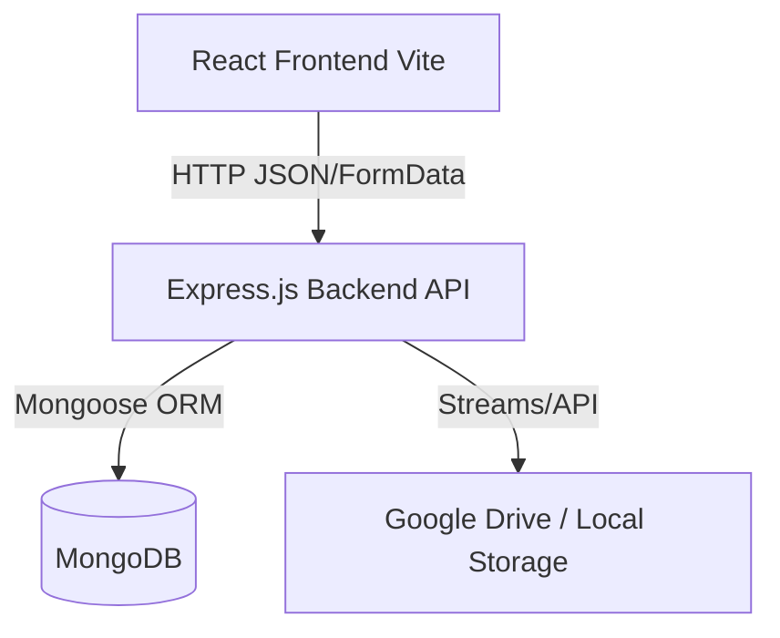

# High-Level Architecture Overview

The Aditya University Intranet Portal follows a standard **MERN** (MongoDB, Express.js, React, Node.js) architecture, enhanced with specific design patterns in the backend to promote scalability and maintainability.

## System Diagram

## 1. The Client Layer (Frontend)
The frontend (`aus_intranet/login/`) is a React application utilizing Vite. 
* **State:** Global state (like the logged-in User profile and JWT) is managed via contexts or specific state managers.
* **Routing:** React Router DOM manages transitions between role-specific dashboards (`Admin`, `DeanPage`, `HodPage`, `FacultyDashboard`, `StudentDashboard`).
* **Communication:** Axios interceptors are used to automatically attach the JWT `Authorization: Bearer <token>` to every backend request.

## 2. The API Layer (Backend)
The backend (`aus_intranet/backend/`) is an Express.js server defining strict RESTful endpoints.

### The Request Lifecycle
1. **Route (`routes/*.js`):** Receives the HTTP request (e.g., `POST /api/materials`).
2. **Middleware (`middleware/authMiddleware.js`):** Validates the JWT and ensures the user has permission to hit the endpoint (Role-Based Access Control).
3. **Controller (`controllers/*.js`):** Parses the request `req.body` or `req.files`, delegates business logic to Services or Adapters, and formats the JSON response.
4. **Service/Command (`services/`):** Executes complex business logic (e.g., coordinating multiple database calls).
5. **Model (`models/*.js`):** Mongoose schemas interact with the MongoDB database.

## 3. The Pattern Layer
To abstract third-party tools and complex logic, the backend uses:
* **Adapters (`adapters/`):** Wrapping file storage APIs (Google Drive) so controllers don't care *where* files are saved.
* **Strategies (`strategies/`):** Handling variations in logic depending on User Roles.
* **Factories (`factories/`):** Encapsulating the complex creation of objects.

## 4. The Data Layer
MongoDB handles all structured data mapping, utilizing relationships (`ref`) to link Announcements, Materials, and Achievements back to specific Users and Roles.
