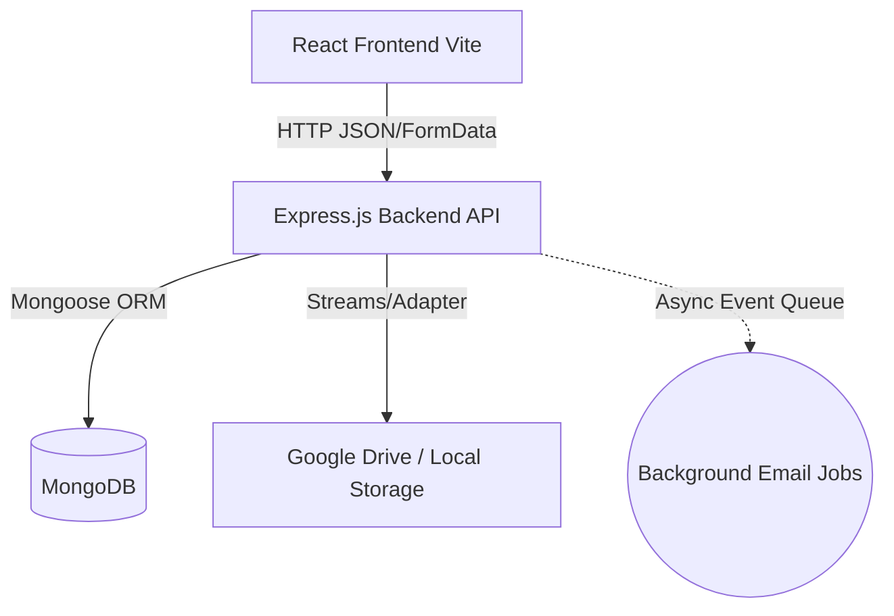

# High-Level Architecture Overview

The Aditya University Intranet Portal follows a standard **MERN** (MongoDB, Express.js, React, Node.js) architecture, enhanced with specific design patterns in the backend to promote scalability and maintainability.

## System Diagram



## 1. The Client Layer (Frontend)
The frontend (`aus_intranet/login/`) is a React application utilizing Vite. 
* **State:** Global state (like the logged-in User profile and JWT) is managed via contexts or specific state managers.
* **Routing:** React Router DOM manages transitions between role-specific dashboards (`Admin`, `DeanPage`, `HodPage`, `FacultyDashboard`, `StudentDashboard`).
* **Communication:** Axios interceptors are used to automatically attach the JWT `Authorization: Bearer <token>` to every backend request.

## 2. The API Layer (Backend)
The backend (`aus_intranet/backend/`) is an Express.js server defining strict RESTful endpoints.

### The Request Lifecycle
1. **Route (`routes/*.js`):** Receives the HTTP request (e.g., `POST /api/materials`).
2. **Middleware (`middleware/authMiddleware.js`):** Validates the JWT and ensures the user has permission to hit the endpoint (Role-Based Access Control).
3. **Controller (`controllers/*.js`):** Parses the request `req.body` or `req.files`, delegates business logic to Services or Adapters, and formats the JSON response.
4. **Service/Command (`services/`):** Executes complex business logic (e.g., coordinating multiple database calls).
5. **Model (`models/*.js`):** Mongoose schemas interact with the MongoDB database.

### Route Mounting & Collision Warning
Currently, in `server.js`, almost all feature routes are mounted directly at the root path (`/`):
```javascript
app.use('/', userRoutes);
app.use('/', pdfRoutes);
```
> **WARNING:** This flat architecture is highly prone to **Route Collisions**. If `pdfRoutes.js` and `materialRoutes.js` both define a `router.post('/upload')`, Express will execute whichever router was imported and mounted first, completely ignoring the second one. Future architecture refactors should aim to namespace these routes (e.g., `app.use('/api/pdf', pdfRoutes)`).

## 3. The Pattern Layer
To abstract third-party tools and complex logic, the backend uses:
* **Adapters (`adapters/`):** Wraps external APIs (e.g., `GoogleDriveAdapter`, `LocalStorageAdapter`). By setting `STORAGE_MODE=local` in your `.env`, the system injects the local adapter so you can develop without GCP credentials.
* **Strategies (`strategies/`):** Handles variations in logic depending on User Roles.
* **Factories (`factories/`):** Encapsulates the complex creation of objects.

## 4. Asynchronous Background Jobs
Heavy operations, like sending emails via `EmailService.js`, are not executed during the synchronous HTTP request/response cycle. Doing so would cause frontend timeouts.
* Instead, the controller dispatches an event/job to a background queue.
* The API responds to the client immediately (e.g., "Registration successful").
* The background worker picks up the job and dispatches the email. Locally, configuring Mailtrap in `.env` intercepts these so you don't spam real users.

## 5. The Data Layer & Sub-Roles
MongoDB handles structured data mapping. While the primary `Role` is fixed on the User document, secondary permissions are handled via `SubRole` collections (`models/SubRole.js`). These sub-roles link back to the User and dictate overlapping architectural permissions (e.g., a "Faculty" member who also holds the "Event Coordinator" Sub-Role).
