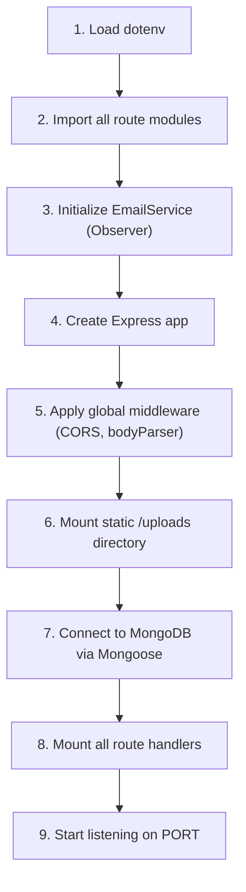
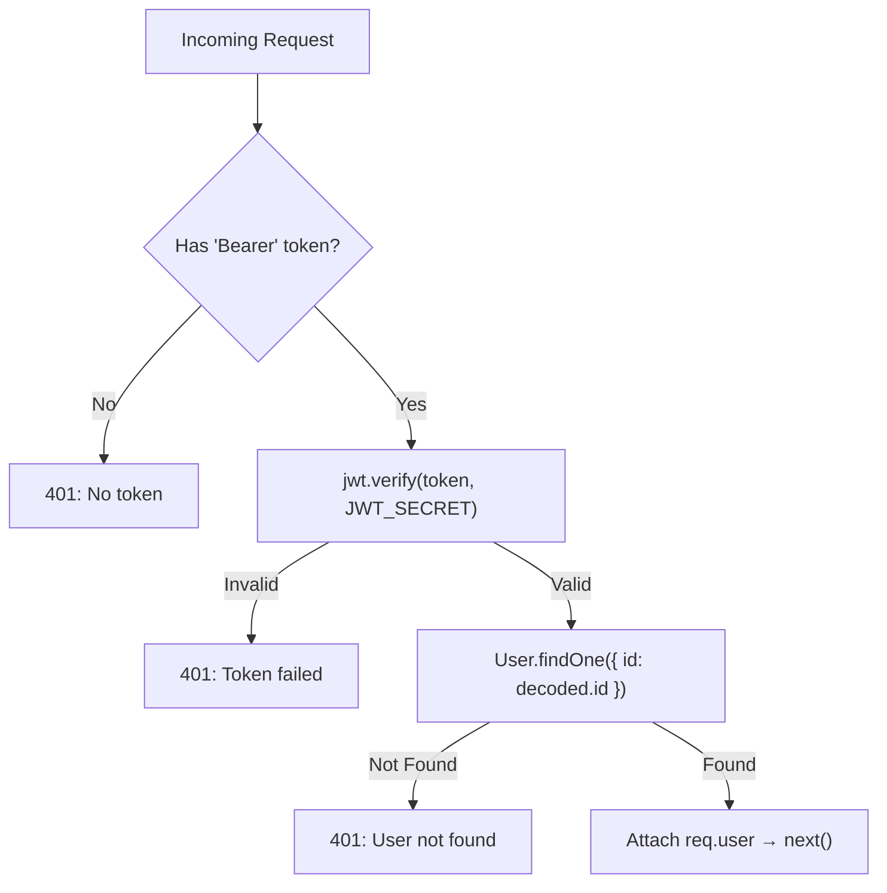
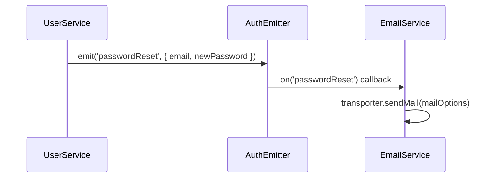
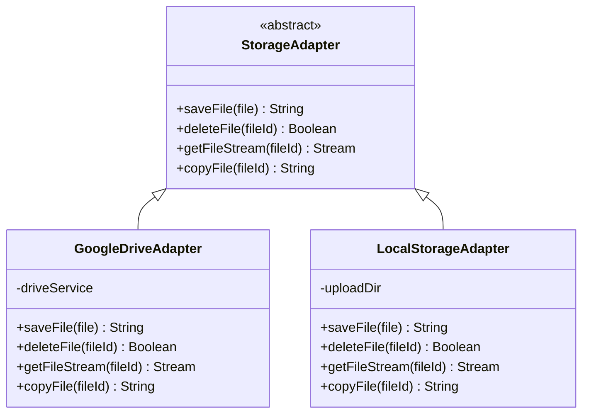
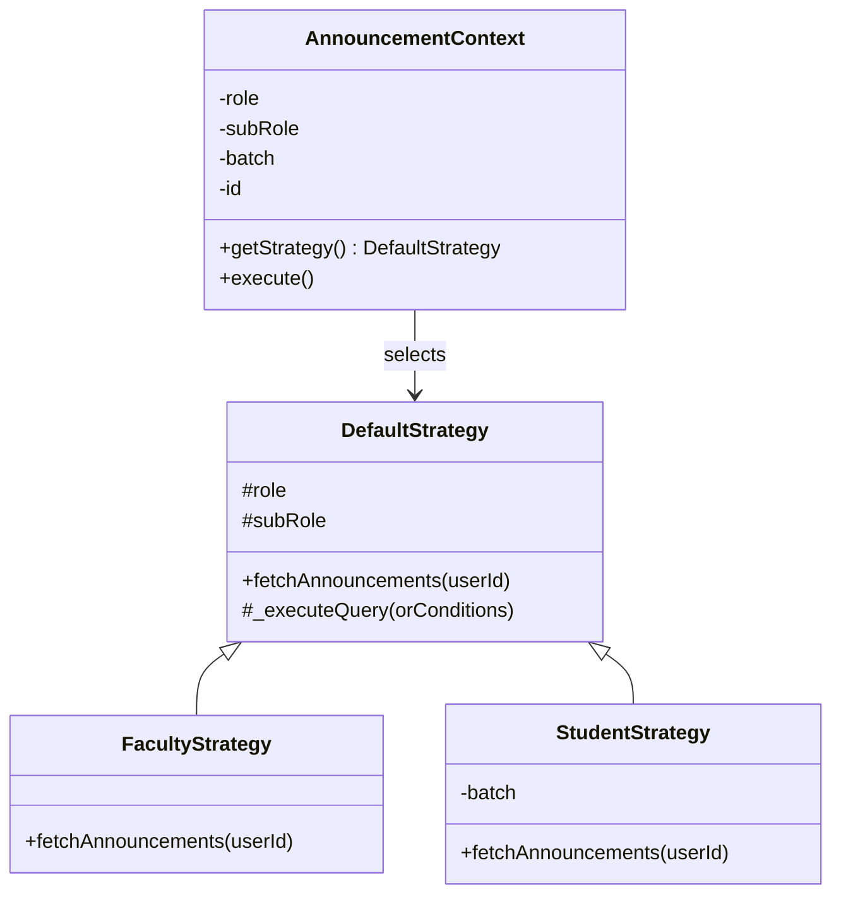
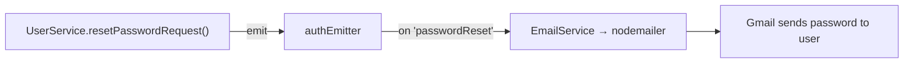
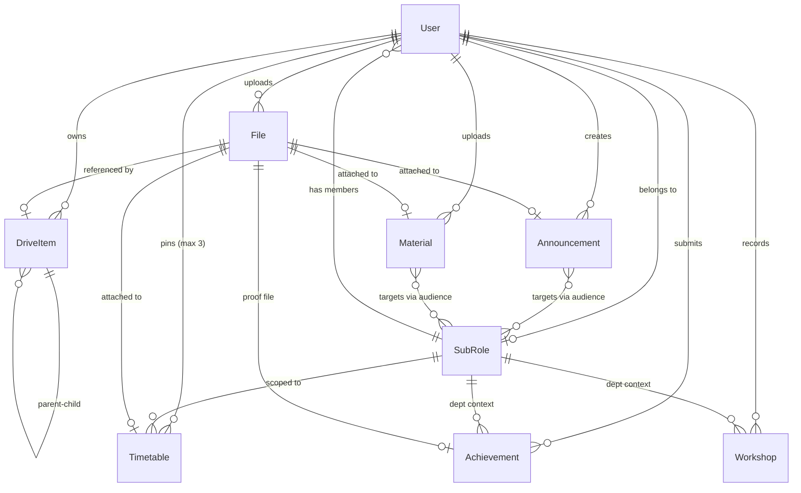
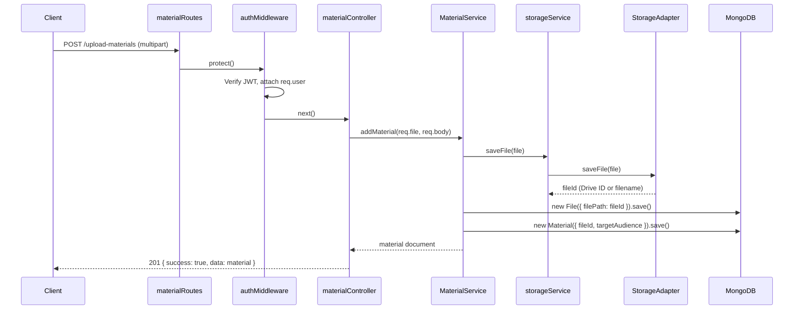
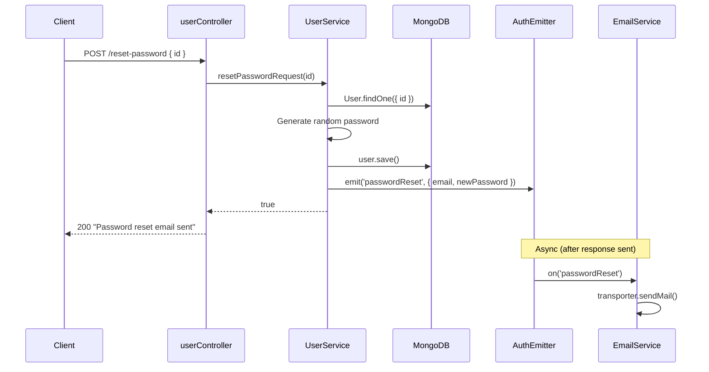
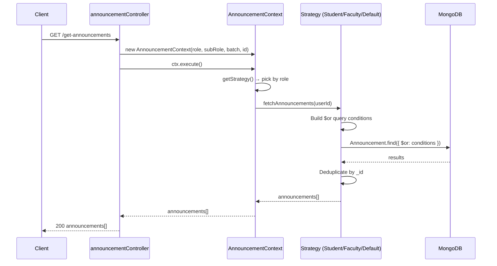

# Low-Level Design (LLD)

This document provides a detailed, component-level breakdown of the entire backend system. It covers every file, its purpose, its internal logic, and how it connects to other components. Refer to [high-level-design.md](./high-level-design.md) for the bird's-eye view.

---

## Table of Contents

1. [Directory Structure](#1-directory-structure)
2. [Entry Point — `server.js`](#2-entry-point--serverjs)
3. [Data Layer — Models](#3-data-layer--models)
4. [Middleware Layer](#4-middleware-layer)
5. [Route Layer](#5-route-layer)
6. [Controller Layer](#6-controller-layer)
7. [Service Layer](#7-service-layer)
8. [Adapter Layer (Storage)](#8-adapter-layer-storage)
9. [Strategy Layer (Announcements)](#9-strategy-layer-announcements)
10. [Factory Layer](#10-factory-layer)
11. [Event Layer (Observer Pattern)](#11-event-layer-observer-pattern)
12. [Scripts](#12-scripts)
13. [Design Patterns Summary](#13-design-patterns-summary)
14. [Entity Relationship Diagram](#14-entity-relationship-diagram)
15. [Request Lifecycle Sequence Diagrams](#15-request-lifecycle-sequence-diagrams)

---

## 1. Directory Structure

```
backend/
├── server.js              # Application entry point
├── .env                   # Environment configuration
├── package.json
│
├── models/                # Mongoose schemas (Data Layer)
│   ├── User.js
│   ├── SubRole.js
│   ├── Achievement.js
│   ├── Announcement.js
│   ├── File.js
│   ├── Material.js
│   ├── Timetable.js
│   ├── DriveItem.js
│   ├── Workshop.js
│   ├── GuestLecture.js
│   ├── IndustrialVisit.js
│   ├── FdpPdpOrganized.js
│   └── FdpSttpAttended.js
│
├── middleware/             # Express middleware (Auth & RBAC)
│   ├── authMiddleware.js
│   └── roleMiddleware.js
│
├── routes/                # HTTP endpoint definitions
│   ├── authRoutes.js
│   ├── userRoutes.js
│   ├── dashboardRoutes.js
│   ├── announcementRoutes.js
│   ├── materialRoutes.js
│   ├── driveRoutes.js
│   ├── timetableRoutes.js
│   ├── achievementRoutes.js
│   ├── workshopRoutes.js
│   ├── guestLectureRoutes.js
│   ├── industrialVisitRoutes.js
│   ├── fdpPdpRoutes.js
│   ├── fdpSttpRoutes.js
│   └── subRoleRoutes.js
│
├── controllers/           # Request handlers
│   ├── authController.js
│   ├── userController.js
│   ├── announcementController.js
│   ├── materialController.js
│   ├── driveController.js
│   ├── timetableController.js
│   ├── achievementController.js
│   ├── workshopController.js
│   ├── guestLectureController.js
│   ├── industrialVisitController.js
│   ├── fdpPdpController.js
│   ├── fdpSttpController.js
│   └── subRoleController.js
│
├── services/              # Business logic
│   ├── AuthService.js
│   ├── UserService.js
│   ├── DriveService.js
│   ├── MaterialService.js
│   ├── TimetableService.js
│   ├── WorkshopService.js
│   ├── GuestLectureService.js
│   ├── IndustrialVisitService.js
│   ├── FdpPdpService.js
│   ├── FdpSttpService.js
│   ├── EmailService.js
│   └── storageService.js
│
├── adapters/              # External API abstractions
│   ├── StorageAdapter.js
│   ├── GoogleDriveAdapter.js
│   └── LocalStorageAdapter.js
│
├── strategies/            # Announcement query strategies
│   ├── AnnouncementContext.js
│   ├── DefaultStrategy.js
│   ├── FacultyStrategy.js
│   └── StudentStrategy.js
│
├── factories/             # Object construction
│   └── UserFactory.js
│
├── events/                # Event emitters (Observer Pattern)
│   └── AuthEvents.js
│
├── scripts/               # CLI utilities
│   └── sync-db.js
│
└── uploads/               # Local file storage (when STORAGE_TYPE=LOCAL)
```

---

## 2. Entry Point — `server.js`

**File:** `server.js`

The application entry point wires together Express, Mongoose, middleware, and all route modules.

### Boot Sequence



### Current Route Mounting

| Mount Path | Route Module | Notes |
|:---|:---|:---|
| `/dashboard` | `dashboardRoutes` | Only namespaced route |
| `/auth` | `authRoutes` | Auth-specific namespace |
| `/` | `userRoutes` | Root-mounted (collision risk) |
| `/` | `driveRoutes` | Root-mounted |
| `/` | `materialRoutes` | Root-mounted |
| `/` | `achievementRoutes` | Root-mounted |
| `/` | `timetableRoutes` | Root-mounted |
| `/` | `announcementRoutes` | Root-mounted |
| `/` | `workshopRoutes` | Root-mounted |
| `/` | `guestLectureRoutes` | Root-mounted |
| `/` | `industrialVisitRoutes` | Root-mounted |
| `/` | `fdpPdpRoutes` | Root-mounted |
| `/` | `fdpSttpRoutes` | Root-mounted |
| `/` | `subRoleRoutes` | Root-mounted |

> [!WARNING]
> Most routes are mounted at `/`, making them vulnerable to route collisions. See the [high-level-design.md](./high-level-design.md) for the full warning.

---

## 3. Data Layer — Models

All models use Mongoose and reside in `models/`. Below is every schema with its fields, types, and relationships.

---

### 3.1 `User.js`

The central identity model. Every authenticated action traces back to a User.

| Field | Type | Required | Notes |
|:---|:---|:---|:---|
| `username` | `String` | ✅ | Display name |
| `id` | `String` | ✅ (unique) | Login ID (Roll No / Faculty ID) |
| `password` | `String` | ✅ | Stored as plaintext (no hashing) |
| `role` | `String` (enum) | ✅ | `Student`, `Officers`, `Dean`, `Asso.Dean`, `HOD`, `Faculty`, `Admin` |
| `subRole` | `ObjectId → SubRole` | — | Department reference, `null` for Admin |
| `batch` | `String` | Only if Student | e.g. `"2024-2028"` |
| `canUploadTimetable` | `Boolean` | — | Faculty-only permission flag |
| `permissions.approveStudentAchievements` | `Boolean` | — | Granular permission |
| `permissions.approveFacultyAchievements` | `Boolean` | — | Granular permission |
| `permissions.canManageWorkshops` | `Boolean` | — | Granular permission |
| `permissions.canManageGuestLectures` | `Boolean` | — | Granular permission |
| `permissions.canManageIndustrialVisits` | `Boolean` | — | Granular permission |
| `permissions.canManageFdpPdp` | `Boolean` | — | Granular permission |
| `permissions.canManageFdpSttp` | `Boolean` | — | Granular permission |
| `pinnedTimetables` | `[ObjectId → Timetable]` | — | Max 3 pinned timetables |

---

### 3.2 `SubRole.js`

Represents a department or administrative unit. Acts as the bridge for department-scoped queries.

| Field | Type | Required | Notes |
|:---|:---|:---|:---|
| `name` | `String` | ✅ | Full name, e.g. "Computer Science and Engineering" |
| `code` | `String` (unique, uppercase) | ✅ | Short code, e.g. "CSE", "AIML" |
| `displayName` | `String` | ✅ | UI-friendly name, e.g. "CSE" |
| `allowedRoles` | `[String]` (enum) | — | Which roles can belong to this department |

---

### 3.3 `File.js`

The central physical file record. Every uploaded file (timetable, material, announcement attachment, achievement proof) creates a `File` document.

| Field | Type | Required | Notes |
|:---|:---|:---|:---|
| `fileName` | `String` | ✅ | Original filename |
| `filePath` | `String` (unique) | ✅ | Storage ID — Google Drive File ID or local filename |
| `fileType` | `String` | — | MIME type, e.g. `"application/pdf"` |
| `fileSize` | `Number` | — | Size in bytes |
| `uploadedBy` | `ObjectId → User` | ✅ | Who uploaded it |
| `usage.isPersonal` | `Boolean` | — | Visible in "My Data" |
| `usage.isAnnouncement` | `Boolean` | — | Linked to an Announcement |
| `usage.isAchievement` | `Boolean` | — | Linked to an Achievement |
| `usage.isDeptDocument` | `Boolean` | — | Linked to a department document |
| `uploadedAt` | `Date` | — | Auto-set |

> [!IMPORTANT]
> `File.js` is the **only model** that directly interacts with the physical storage layer. All other models (Timetable, Material, Announcement, Achievement) reference a `File` via `fileId`.

---

### 3.4 `DriveItem.js`

Virtual file system that enables a folder-based "My Drive" experience for each user.

| Field | Type | Required | Notes |
|:---|:---|:---|:---|
| `name` | `String` | ✅ | Display name |
| `type` | `String` (enum) | ✅ | `"folder"` or `"file"` |
| `parent` | `ObjectId → DriveItem` | — | `null` = root level |
| `owner` | `ObjectId → User` | ✅ | User who owns this item |
| `fileId` | `ObjectId → File` | — | Only set when `type="file"` |
| `createdAt` | `Date` | — | Auto-set |
| `updatedAt` | `Date` | — | Auto-updated via `pre('save')` hook |

---

### 3.5 `Announcement.js`

Broadcast announcements targeted at specific audiences.

| Field | Type | Required | Notes |
|:---|:---|:---|:---|
| `title` | `String` | ✅ | |
| `description` | `String` | ✅ | |
| `fileId` | `ObjectId → File` | — | Optional attachment |
| `uploadedAt` | `Date` | — | Auto-set |
| `uploadedBy` | `ObjectId → User` | ✅ | |
| `targetAudience` | `[{ role, subRole?, batch? }]` | — | Audience targeting rules |

---

### 3.6 `Material.js`

Shared academic files (lecture notes, assignments) with audience-based visibility.

| Field | Type | Required | Notes |
|:---|:---|:---|:---|
| `title` | `String` | ✅ | |
| `subject` | `String` | ✅ | |
| `targetAudience` | `[{ role, subRole?, batch? }]` | — | Audience targeting rules |
| `targetIndividualIds` | `[String]` | — | Specific user overrides |
| `hiddenFor` | `[String]` | — | Users who "deleted" (hid) this |
| `fileId` | `ObjectId → File` | ✅ | |
| `uploadedBy` | `ObjectId → User` | ✅ | |

---

### 3.7 `Timetable.js`

Department timetables, unique per SubRole + Year + Section.

| Field | Type | Required | Notes |
|:---|:---|:---|:---|
| `targetYear` | `Number` | ✅ | |
| `targetSection` | `Number` | ✅ | |
| `subRole` | `ObjectId → SubRole` | ✅ | Department |
| `batch` | `String` | — | Optional batch filter |
| `fileId` | `ObjectId → File` | ✅ | |
| `uploadedBy` | `ObjectId → User` | ✅ | |

---

### 3.8 `Achievement.js`

Student and faculty achievements with an approval workflow.

| Field | Type | Notes |
|:---|:---|:---|
| `type` | `String` | Achievement category |
| `status` | `Pending` / `Approved` / `Rejected` | Approval state |
| `userId` | `String` | Submitter's login ID |
| `userRole` | `String` | `Student` or `Faculty` |
| `proofFileId` | `ObjectId → File` | Proof document |
| `dept` | `ObjectId → SubRole` | Department context |
| `approvedBy`, `approverId`, `approverRole` | `String` | Approval trail |
| *Dynamic fields* | Various | Category-specific: certificationName, companyName, journalName, etc. |

---

### 3.9 `Workshop.js`

Faculty workshop/event records tied to a department.

| Field | Type | Required | Notes |
|:---|:---|:---|:---|
| `userId` | `String` | ✅ | Faculty login ID |
| `userRole` | `String` | — | Defaults to `'Faculty'` |
| `userName` | `String` | — | Display name from User |
| `dept` | `ObjectId → SubRole` | ✅ | Department |
| `academicYear` | `String` | ✅ | |
| `activityName` | `String` | ✅ | |
| `startDate` / `endDate` | `Date` | ✅ | |
| `resourcePerson` | `String` | ✅ | |
| `professionalBody` | `String` | — | e.g. IEEE, CSI |
| `studentCount` | `Number` | ✅ | |
| `contactHours` | `Number` | ✅ | No. of contact hours |

---

## 4. Middleware Layer

### 4.1 `authMiddleware.js` — JWT Authentication

**Function:** `protect(req, res, next)`



### 4.2 `roleMiddleware.js` — Role-Based Access Control

**Function:** `authorize(...roles)`

A higher-order middleware factory. Checks if `req.user.role` is in the allowed roles array. Returns `403 Forbidden` if not.

**Usage example:**
```javascript
router.post('/create', protect, authorize('Admin', 'HOD'), controller.create);
```

---

## 5. Route Layer

Each route file defines Express `Router` endpoints and applies the appropriate middleware chain.

### Route → Controller Mapping

| Route File | Key Endpoints | Controller |
|:---|:---|:---|
| `authRoutes.js` | `POST /auth/register`, `POST /auth/login` | `authController` |
| `userRoutes.js` | `GET /get-users`, `PUT /toggle-permission`, `PUT /change-password`, `POST /reset-password` | `userController` |
| `dashboardRoutes.js` | `GET /dashboard/*` | Inline handlers |
| `announcementRoutes.js` | `POST /upload-announcement`, `GET /get-announcements`, `DELETE /delete-announcement/:id` | `announcementController` |
| `materialRoutes.js` | `POST /upload-materials`, `GET /get-shared-materials` | `materialController` |
| `driveRoutes.js` | `GET /drive/items`, `POST /drive/folder`, `POST /drive/upload`, `PUT /drive/rename/:id`, `PUT /drive/move/:id`, `DELETE /drive/delete/:id`, `POST /drive/copy/:id`, `GET /drive/search` | `driveController` |
| `timetableRoutes.js` | `POST /upload-timetable`, `GET /get-timetables` | `timetableController` |
| `achievementRoutes.js` | `POST /achievements`, `GET /achievements`, `PUT /achievements/:id/approve` | `achievementController` |
| `workshopRoutes.js` | `POST /workshops`, `GET /workshops` | `workshopController` |
| `guestLectureRoutes.js` | `POST /guest-lectures`, `GET /guest-lectures` | `guestLectureController` |
| `industrialVisitRoutes.js` | `POST /industrial-visits`, `GET /industrial-visits` | `industrialVisitController` |
| `fdpPdpRoutes.js` | `POST /fdp-pdp`, `GET /fdp-pdp` | `fdpPdpController` |
| `fdpSttpRoutes.js` | `POST /fdp-sttp`, `GET /fdp-sttp` | `fdpSttpController` |
| `subRoleRoutes.js` | `GET /sub-roles`, `POST /sub-roles` | `subRoleController` |

---

## 6. Controller Layer

Controllers are the **thin orchestration layer** between routes and services. They follow a consistent pattern:

```
1. Extract data from req.body / req.files / req.params / req.query
2. Call the appropriate Service method
3. Return JSON response
4. Catch errors and return appropriate status codes
```

> [!NOTE]
> Controllers **never** contain business logic or direct database calls. They delegate everything to the Service layer.

---

## 7. Service Layer

Services contain all business logic and are the core of the application.

---

### 7.1 `AuthService.js`

| Method | Purpose | Key Logic |
|:---|:---|:---|
| `register(userData)` | Create a new user | Validates uniqueness, resolves SubRole by name/code/displayName, enforces role constraints (e.g. only one HOD per department), uses `UserFactory.create()` |
| `login(id, password)` | Authenticate and issue JWT | Case-insensitive ID lookup, populates SubRole, signs JWT with `JWT_SECRET` |
| `updateUsername(id, newUsername)` | Update display name | Simple find-and-save |

---

### 7.2 `UserService.js`

| Method | Purpose |
|:---|:---|
| `getUsers({ role, dept, batch, search })` | List users with dynamic filters. Resolves `dept` string → ObjectId. |
| `getDeptFaculty(dept)` | Get faculty members of a specific department. |
| `toggleTimetablePermission(id, canUpload)` | Enable/disable timetable upload for a faculty member. |
| `toggleAchievementPermission(id, permissionType, allowed)` | Toggle `approveStudentAchievements` or `approveFacultyAchievements`. |
| `toggleWorkshopPermission(id, allowed)` | Toggle `canManageWorkshops` for faculty. |
| `toggleGuestLecturePermission(id, allowed)` | Toggle `canManageGuestLectures` for faculty. |
| `toggleIndustrialVisitPermission(id, allowed)` | Toggle `canManageIndustrialVisits` for faculty. |
| `toggleFdpPdpPermission(id, allowed)` | Toggle `canManageFdpPdp` for faculty. |
| `toggleFdpSttpPermission(id, allowed)` | Toggle `canManageFdpSttp` for faculty. |
| `changePassword(user, currentPassword, newPassword)` | Validate current password and update. |
| `togglePin(userId, timetableId)` | Pin/unpin a timetable (max 3). |
| `getPinnedTimetables(userId)` | Fetch pinned timetables with populated data. |
| `resetPasswordRequest(id)` | Generate random password and emit `passwordReset` event → triggers email. |

---

### 7.3 `DriveService.js` (384 lines — Largest Service)

Implements a full virtual file system experience.

| Method | Purpose |
|:---|:---|
| `getDriveItems(userId, folderId)` | List items in a folder. Includes legacy migration logic for old `File` records into `DriveItem`. |
| `createFolder(name, parentId, userId)` | Create a virtual folder. |
| `uploadFiles(files, body)` | Upload one or more files. Creates both `File` and `DriveItem` records. |
| `renameItem(id, newName)` | Rename a DriveItem. |
| `moveItem(id, newParentId)` | Move a DriveItem to another folder. Includes circular reference prevention. |
| `deleteItem(id)` | Recursively delete a folder and its contents (both DB records and physical files). |
| `getFolders(userId)` | List all folders for a folder picker UI. |
| `copyItem(itemId, targetParentId, userId)` | Deep-copy a file or folder (including nested children). Uses `storageService.copyFile()` for physical copies. |
| `searchDrive(userId, query)` | Search files/folders by name (regex). |
| `getPersonalFiles(id)` | Legacy endpoint for personal files. |
| `uploadPersonalFile(files, body)` | Legacy upload as personal file. |
| `getFileStream(id)` | Stream a file from storage for download. |

---

### 7.4 `MaterialService.js`

| Method | Purpose |
|:---|:---|
| `addMaterial(file, body)` | Upload a material with audience targeting. Validates targets against `SubRole`. Implements role hierarchy for upload permissions. |
| `getMaterials({ role, subRole, batch, id })` | Complex audience matching — builds Mongo `$or` queries based on role, department, batch, and individual overrides. Filters out hidden materials. |
| `copySharedToDrive(materialId, targetFolderId, userId)` | Copy a shared material into the user's personal drive. |
| `hideSharedMaterial(materialId, userId)` | Soft-delete a material for a specific user. |

**Role Hierarchy** (used for upload gatekeeping):
```
Admin(1) > Officers(2) > Dean(3) > Asso.Dean(4) > HOD(5) > Faculty(6) > Student(7)
```

---

### 7.5 `TimetableService.js`

| Method | Purpose |
|:---|:---|
| `addTimetable(user, file, subRole, batch, targetYear, targetSection)` | Upload or replace a timetable. Uses a safe strategy: upload new file first, then delete old. Uniqueness is enforced by `SubRole + Year + Section`. |

---

## IQAC Services

The following services handle CRUD operations and filtering for the faculty event modules grouped under IQAC. They all follow a similar pattern and expose identical interfaces.

### 7.8 `WorkshopService.js`

| Method | Purpose |
|:---|:---|
| `resolveDeptId(dept)` | Resolves a department string (code/displayName/name) to its ObjectId. Returns the ID directly if already valid. |
| `addWorkshop(userId, data)` | Looks up the User by login ID, attaches `userName`, `dept`, and `userRole` context, then creates and saves the Workshop. |
| `getWorkshops({ userId, dept, academicYear })` | Builds a dynamic filter. Resolves `dept` via `resolveDeptId()`. Returns sorted workshops. |
| `deleteWorkshop(id)` | Deletes a workshop by its MongoDB `_id`. |
| `updateWorkshop(id, data)` | Updates a workshop by its MongoDB `_id`. |

---

### 7.9 `GuestLectureService.js`

| Method | Purpose |
|:---|:---|
| `addGuestLecture(userId, data)` | Creates a new Guest Lecture record. |
| `getGuestLectures({ userId, dept, academicYear })` | Dynamic filter. Returns sorted records. |
| `deleteGuestLecture(id)` | Deletes a guest lecture. |
| `updateGuestLecture(id, data)` | Updates a guest lecture. |

---

### 7.10 `IndustrialVisitService.js`

| Method | Purpose |
|:---|:---|
| `addIndustrialVisit(userId, data)` | Creates a new Industrial Visit record. |
| `getIndustrialVisits({ userId, dept, academicYear })` | Dynamic filter. Returns sorted records. |
| `deleteIndustrialVisit(id)` | Deletes an industrial visit. |
| `updateIndustrialVisit(id, data)` | Updates an industrial visit. |

---

### 7.11 `FdpPdpService.js`

| Method | Purpose |
|:---|:---|
| `addFdpPdp(userId, data)` | Creates a new FDP/PDP record. |
| `getFdpPdps({ userId, dept, academicYear })` | Dynamic filter. Returns sorted records. |
| `deleteFdpPdp(id)` | Deletes an FDP/PDP record. |
| `updateFdpPdp(id, data)` | Updates an FDP/PDP record. |

---

### 7.12 `FdpSttpService.js`

| Method | Purpose |
|:---|:---|
| `addFdpSttp(userId, data)` | Creates a new FDP/STTP (Outside) record. |
| `getFdpSttps({ userId, dept, academicYear })` | Dynamic filter. Returns sorted records. |
| `deleteFdpSttp(id)` | Deletes an FDP/STTP (Outside) record. |
| `updateFdpSttp(id, data)` | Updates an FDP/STTP (Outside) record. |

---
*(End of IQAC Services)*
---

### 7.6 `EmailService.js` (Observer)

Not called directly. Subscribes to the `AuthEvents` emitter and listens for `passwordReset` events.



---

### 7.7 `storageService.js` (Singleton)

A facade that delegates to the active `StorageAdapter`. Instantiated once at import time.

| Env Variable | Adapter Selected |
|:---|:---|
| `STORAGE_TYPE=DRIVE` | `GoogleDriveAdapter` |
| `STORAGE_TYPE=LOCAL` (default) | `LocalStorageAdapter` |

---

## 8. Adapter Layer (Storage)

Implements the **Adapter Pattern** to abstract cloud vs. local file storage.

### Class Hierarchy



| Method | GoogleDriveAdapter | LocalStorageAdapter |
|:---|:---|:---|
| `saveFile()` | Uploads buffer to Google Drive via API → returns Drive File ID | Writes buffer to `uploads/` with timestamped filename → returns filename |
| `deleteFile()` | Calls `drive.files.delete()` | Calls `fs.unlink()` |
| `getFileStream()` | Calls `drive.files.get({ alt: 'media' })` | Returns `fs.createReadStream()` |
| `copyFile()` | Calls `drive.files.copy()` → returns new Drive ID | Calls `fs.copyFile()` → returns new filename |

---

## 9. Strategy Layer (Announcements)

Implements the **Strategy Pattern** to handle role-specific announcement queries.

### Class Hierarchy



### Query Logic Per Strategy

| Strategy | What announcements a user sees |
|:---|:---|
| **DefaultStrategy** (Admin, Dean, HOD, etc.) | `targetAudience.role = 'All'` OR `targetAudience.role = myRole` OR `uploadedBy = me` |
| **FacultyStrategy** | All of Default + `targetAudience = { role:'Faculty', subRole: myDept }` + `{ role:'Faculty', subRole: null (All depts) }` |
| **StudentStrategy** | All of Default + complex batch/dept matching with 4 criteria levels (All → Dept → Dept+Batch → All+Batch) |

---

## 10. Factory Layer

### `UserFactory.js`

Implements the **Factory Pattern** for creating `User` documents with proper defaults.

```javascript
UserFactory.create({ username, id, password, role, subRole, batch })
```

**Key logic:**
- Normalizes `id` to uppercase
- Sets `subRole = null` if role is `Admin`
- Sets `batch = null` if role is not `Student`
- Sets `canUploadTimetable = false` by default

---

## 11. Event Layer (Observer Pattern)

### `AuthEvents.js`

A Node.js `EventEmitter` singleton exported as `authEmitter`.

**Event:** `passwordReset`



This decouples the password reset logic from the email-sending logic. The HTTP response returns immediately while the email is sent asynchronously in the background.

---

## 12. Scripts

### `scripts/sync-db.js`

CLI utility to clone the Production database into Staging. See [database-scripts.md](../03-api-contracts/database-scripts.md) for full documentation.

**Safety guards:** URI name validation, duplicate URI detection, interactive `YES` confirmation.

**Run with:**
```bash
npm run sync-db
```

---

## 13. Design Patterns Summary

| Pattern | Where Used | Purpose |
|:---|:---|:---|
| **Adapter** | `adapters/StorageAdapter.js` → `GoogleDriveAdapter`, `LocalStorageAdapter` | Abstract storage backends behind a common interface |
| **Strategy** | `strategies/AnnouncementContext.js` → `StudentStrategy`, `FacultyStrategy`, `DefaultStrategy` | Role-specific announcement query logic |
| **Factory** | `factories/UserFactory.js` | Standardize User creation with role-based defaults |
| **Observer** | `events/AuthEvents.js` + `services/EmailService.js` | Decouple email sending from the HTTP request lifecycle |
| **Singleton** | `services/storageService.js` | Single shared instance of the storage adapter |
| **MVC** | `routes/ → controllers/ → services/ → models/` | Separation of concerns across the request lifecycle |

---

## 14. Entity Relationship Diagram



---

## 15. Request Lifecycle Sequence Diagrams

### 15.1 File Upload (Material)



### 15.2 Password Reset (Observer Flow)



### 15.3 Announcement Fetch (Strategy Flow)


