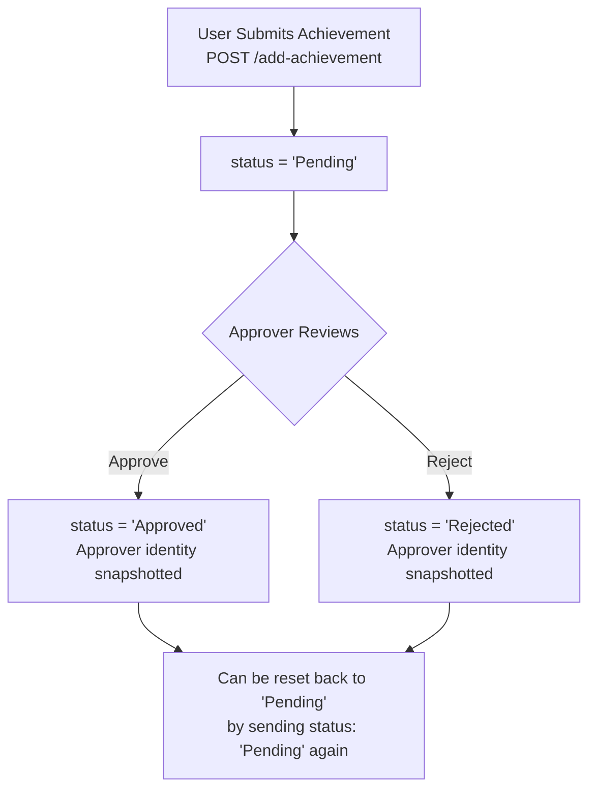
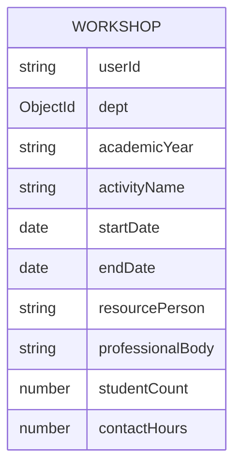

# Achievements & IQAC Modules — API Contracts

> **Covers:** Achievement submission and approval workflow, and all 5 IQAC modules (Workshops, Guest Lectures, Industrial Visits, FDP/PDP, FDP/STTP Outside).

---

## 🏆 Achievements

The achievement system has a **3-stage lifecycle**: Submit → Pending → Approved / Rejected.

### Lifecycle Flowchart



### Who Can Submit vs. Approve?

| Role             | Can Submit          | Can Approve                                                                |
| ---------------- | ------------------- | -------------------------------------------------------------------------- |
| Student          | ✅ Own achievements | ❌                                                                         |
| Faculty          | ✅ Own achievements | ✅ Student achievements (if `approveStudentAchievements` permission is ON) |
| HOD              | ✅ Own achievements | ✅ All dept achievements (student + faculty)                               |
| Asso.Dean / Dean | ✅ Own achievements | ✅ University-wide oversight                                               |
| Admin            | ✅                  | ✅ All                                                                     |

---

### `POST /add-achievement`

Submit a new achievement. The proof file is optional but recommended.

**Content-Type:** `multipart/form-data`

**Form Fields:**

| Field                  | Type              | Required | Notes                                                              |
| ---------------------- | ----------------- | -------- | ------------------------------------------------------------------ |
| `user`                 | JSON String       | ✅       | Stringified current user object                                    |
| `type`                 | String            | ✅       | Achievement category (see types table below)                       |
| `date`                 | String (ISO date) | ✅       | Date of achievement e.g. `"2026-02-10"`                            |
| `proof`                | File (Binary)     | ❌       | Certificate, screenshot, etc. Max 10MB. Field name must be `proof` |
| _Type-specific fields_ | String            | Varies   | See achievement type fields below                                  |

**Achievement Types and Their Fields:**

| `type` Value              | Additional Fields                                                        |
| ------------------------- | ------------------------------------------------------------------------ |
| `Certification`           | `certificationName`, `issuingBody`, `certificateId`, `score`, `duration` |
| `Placement`               | `companyName`, `jobProfile`, `package`, `location`, `offerType`          |
| `Competition`             | `eventName`, `organizer`, `rank`                                         |
| `Activity`                | `activityName`, `role`, `activityType`                                   |
| `Research Paper`          | `title`, `journalName`, `indexing`, `volume`, `isbn`                     |
| `Conference`              | `title`, `conferenceName`                                                |
| `Patent / IP`             | `title`, `ipType`, `appNumber`                                           |
| `FDP / Workshop`          | `programName`, `studentsTrained`, `certBody`                             |
| `Book / Chapter`          | `title`, `publisher`, `isbn`                                             |
| `Project / Collaboration` | `projectName`, `partner`                                                 |

**Example — Student submitting a Certification:**

```javascript
const formData = new FormData();
formData.append("user", JSON.stringify(currentUser));
formData.append("type", "Certification");
formData.append("certificationName", "AWS Solutions Architect");
formData.append("issuingBody", "Amazon Web Services");
formData.append("score", "92%");
formData.append("date", "2026-02-10");
if (proofFile) formData.append("proof", proofFile);

await axios.post("/add-achievement", formData);
```

**Success (201 Created):**

```json
{
  "message": "Achievement added successfully",
  "achievement": {
    "_id": "65abc...",
    "type": "Certification",
    "certificationName": "AWS Solutions Architect",
    "userId": "22CS001",
    "userName": "Veeranna Reddy",
    "userRole": "Student",
    "dept": "64aabb...",
    "status": "Pending",
    "proofFileId": "64def...",
    "proof": "aws_cert.pdf",
    "date": "2026-02-10T00:00:00.000Z"
  }
}
```

---

### `GET /get-achievements`

Fetch achievements with flexible filters.

**Query Parameters:**

| Param    | Example     | Notes                                                                       |
| -------- | ----------- | --------------------------------------------------------------------------- |
| `userId` | `22CS001`   | Filter by submitter's ID                                                    |
| `role`   | `Student`   | Filter by submitter's role. Comma-separated for multiple: `Student,Faculty` |
| `dept`   | `64aabb...` | Filter by department ObjectId or dept name string                           |
| `status` | `Pending`   | `Pending`, `Approved`, or `Rejected`                                        |
| `limit`  | `50`        | Max results (default 100)                                                   |

**Example URLs:**

```
GET /get-achievements?userId=22CS001
GET /get-achievements?role=Student,Faculty&dept=64aabb...&status=Pending
GET /get-achievements?role=Faculty&dept=CSE
```

**Success (200 OK):**

```json
{
  "achievements": [
    {
      "_id": "65abc...",
      "type": "Certification",
      "certificationName": "AWS Solutions Architect",
      "userId": "22CS001",
      "userName": "Veeranna Reddy",
      "userRole": "Student",
      "status": "Approved",
      "approvedBy": "Dr. Ramesh",
      "approverRole": "HOD",
      "date": "2026-02-10T00:00:00.000Z",
      "proofFileId": { "_id": "64def...", "fileName": "aws_cert.pdf" }
    }
  ]
}
```

> [!NOTE]
> There is no pagination — use `limit` to control result size.

---

### `PUT /update-achievement-status`

Approve or reject a pending achievement. Called by HODs, Deans, or permissioned users.

**Content-Type:** `application/json`

**Request Body:**

```json
{
  "id": "65abc...",
  "status": "Approved",
  "approverId": "FAC001",
  "approverName": "Dr. Ramesh",
  "approverRole": "HOD"
}
```

| `status` values | Effect                                        |
| --------------- | --------------------------------------------- |
| `"Approved"`    | Marks as approved, records approver info      |
| `"Rejected"`    | Marks as rejected, records approver info      |
| `"Pending"`     | Resets back to pending (clears approver info) |

**Success (200 OK):**

```json
{
  "message": "Achievement Approved",
  "achievement": { "_id": "65abc...", "status": "Approved", "approvedBy": "Dr. Ramesh", ... }
}
```

---

### `GET /get-leadership-users`

Fetch all HODs and Asso.Deans. Used by the Dean dashboard to build the approver dropdown.

**No parameters required.**

**Success (200 OK):**

```json
{
  "users": [
    {
      "id": "HOD001",
      "username": "Dr. Ramesh",
      "role": "HOD",
      "subRole": "64aabb..."
    }
  ]
}
```

---

## 🛠️ Workshops

Workshops are faculty-recorded training events. Faculty can add their own; HODs manage and generate department reports.

### Workshop Data Fields



---

### `POST /add-workshop`

Add a new workshop record. Faculty must have `canManageWorkshops = true`.

**Content-Type:** `application/json`

**Request Body:**

```json
{
  "userId": "FAC001",
  "academicYear": "2024-2025",
  "activityName": "AI & ML Bootcamp",
  "startDate": "2026-03-01",
  "endDate": "2026-03-03",
  "resourcePerson": "Dr. Priya Sharma",
  "professionalBody": "IEEE",
  "studentCount": 120,
  "contactHours": 15
}
```

**Success (201 Created):**

```json
{
  "message": "Workshop added successfully",
  "workshop": {
    "_id": "66abcd...",
    "activityName": "AI & ML Bootcamp",
    "academicYear": "2024-2025",
    "startDate": "2026-03-01T00:00:00.000Z",
    "endDate": "2026-03-03T00:00:00.000Z",
    "resourcePerson": "Dr. Priya Sharma",
    "professionalBody": "IEEE",
    "studentCount": 120,
    "contactHours": 15
  }
}
```

---

### `GET /get-workshops`

Fetch workshops with optional filters. Used by both faculty (own records) and HODs (full department view).

**Query Parameters:**

| Param          | Example     | Notes                         |
| -------------- | ----------- | ----------------------------- |
| `userId`       | `FAC001`    | Filter by faculty ID          |
| `dept`         | `64aabb...` | Filter by department ObjectId |
| `academicYear` | `2024-2025` | Filter by academic year       |

**Example URL:** `GET /get-workshops?dept=64aabb...&academicYear=2024-2025`

**Success (200 OK):**

```json
{
  "workshops": [
    {
      "_id": "66abcd...",
      "activityName": "AI & ML Bootcamp",
      "startDate": "2026-03-01T00:00:00.000Z",
      "endDate": "2026-03-03T00:00:00.000Z",
      "studentCount": 120,
      "contactHours": 15,
      "resourcePerson": "Dr. Priya Sharma"
    }
  ]
}
```

---

### `PUT /update-workshop/:id`

Update an existing workshop record.

**URL Example:** `PUT /update-workshop/66abcd...`

**Request Body:** Any subset of workshop fields to update.

```json
{
  "studentCount": 135,
  "contactHours": 18
}
```

**Success (200 OK):**

```json
{ "message": "Workshop updated", "workshop": { "_id": "66abcd...", "studentCount": 135, ... } }
```

---

### `DELETE /delete-workshop/:id`

Delete a workshop record.

**URL Example:** `DELETE /delete-workshop/66abcd...`

**Success (200 OK):** `{ "message": "Workshop deleted" }`

---

## 🛠️ Other IQAC Sub-Modules

The following four IQAC sub-modules follow the exact same REST API architecture as the Workshops module, but with different data fields.

### 1. Guest Lectures (`/guest-lectures/*`)

Holds records for guest lectures or expert talks conducted in the department.

| Field             | Type    | Required | Notes                                    |
| ----------------- | ------- | -------- | ---------------------------------------- |
| `userId`          | String  | ✅       | Faculty ID                               |
| `dept`            | ObjectId| ✅       | Department ID (SubRole)                  |
| `academicYear`    | String  | ✅       | e.g., "2024-2025"                        |
| `topic`           | String  | ✅       | Title/Topic of the lecture               |
| `startDate`       | Date    | ✅       | ISO string                               |
| `endDate`         | Date    | ✅       | ISO string                               |
| `resourcePerson`  | String  | ✅       | Name of the speaker                      |
| `studentCount`    | Number  | ✅       | Number of attendees                      |

---

### 2. Industrial Visits (`/industrial-visits/*`)

Tracks visits made by student cohorts to industrial sites.

| Field             | Type    | Required | Notes                                    |
| ----------------- | ------- | -------- | ---------------------------------------- |
| `userId`          | String  | ✅       | Faculty ID                               |
| `dept`            | ObjectId| ✅       | Department ID (SubRole)                  |
| `academicYear`    | String  | ✅       | e.g., "2024-2025"                        |
| `semester`        | String  | ✅       | e.g., "Odd", "Even", or specific number  |
| `classSection`    | String  | ✅       | Class/Cohort name                        |
| `industryName`    | String  | ✅       | Name of the visited organization         |
| `placeOfVisit`    | String  | ✅       | City or location of visit                |
| `startDate`       | Date    | ✅       | ISO string                               |
| `endDate`         | Date    | ✅       | ISO string                               |
| `studentCount`    | Number  | ✅       | Total students attending                 |

---

### 3. FDP/PDP Organized (`/fdp-pdp-organized/*`)

Records for Faculty Development Programs or Professional Development Programs **organized** by the department.

| Field             | Type    | Required | Notes                                    |
| ----------------- | ------- | -------- | ---------------------------------------- |
| `userId`          | String  | ✅       | Faculty ID (Organizer)                   |
| `dept`            | ObjectId| ✅       | Department ID (SubRole)                  |
| `academicYear`    | String  | ✅       | e.g., "2024-2025"                        |
| `type`            | String  | ✅       | e.g., "FDP", "PDP"                       |
| `title`           | String  | ✅       | Title of the program                     |
| `startDate`       | Date    | ✅       | ISO string                               |
| `endDate`         | Date    | ✅       | ISO string                               |
| `resourcePerson`  | String  | ✅       | Speaker or primary facilitator           |
| `participantCount`| Number  | ✅       | Total internal/external participants     |

---

### 4. FDP/STTP Attended (`/fdp-sttp-attended/*`)

Records for programs that faculty members **attended** externally.

| Field             | Type    | Required | Notes                                    |
| ----------------- | ------- | -------- | ---------------------------------------- |
| `userId`          | String  | ✅       | Faculty ID (Attendee)                    |
| `dept`            | ObjectId| ✅       | Department ID (SubRole)                  |
| `facultyName`     | String  | ✅       | Full name of the attendee                |
| `academicYear`    | String  | ✅       | e.g., "2024-2025"                        |
| `title`           | String  | ✅       | Title of the program                     |
| `startDate`       | Date    | ✅       | ISO string                               |
| `endDate`         | Date    | ✅       | ISO string                               |
| `durationDays`    | Number  | ✅       | Self-reported duration in days           |
| `organizedBy`     | String  | ✅       | External host institution                |

---

### API Contract Patterns

All of these modules expose identical endpoints, replacing the noun:

* `POST /add-[module]` — Creates a record (requires the relevant `permissions.canManage[Module] = true`)
* `GET /get-[modules]?userId=...&dept=...&academicYear=...` — Fetches records using dynamic filters.
* `PUT /update-[module]/:id` — Edits a record.
* `DELETE /delete-[module]/:id` — Deletes a record.
