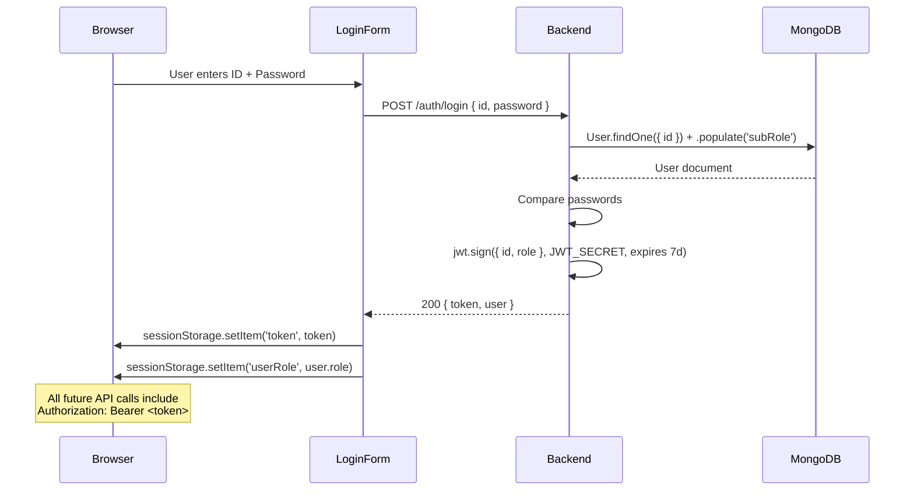
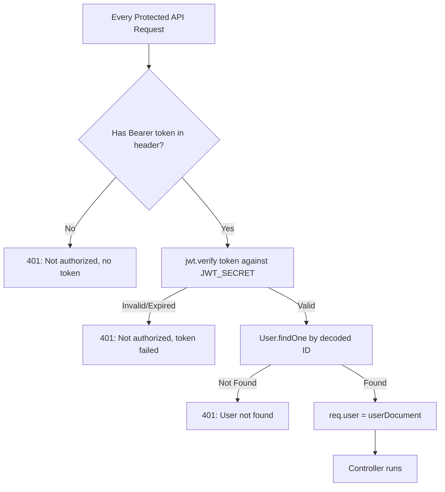

# Auth & User Management — API Contracts

> **Who is this for?** New developers who need to call the backend API from the React frontend or test it with Postman.
>
> All endpoints run on `http://localhost:5001` in development. There is **no `/api` prefix** — routes are mounted directly at the root.

---

## 🔐 Authentication Routes (`/auth/...`)

---

### `POST /auth/register`

Create a new user account. **Admin only in practice** — the Admin dashboard calls this internally.

**Content-Type:** `application/json`

**Request Body:**

```json
{
  "username": "Veeranna Reddy",
  "id": "22CS001",
  "password": "welcome123",
  "role": "Student",
  "subRole": "CSE",
  "batch": "2022-2026"
}
```

| Field      | Type          | Required               | Notes                                                                                                                            |
| ---------- | ------------- | ---------------------- | -------------------------------------------------------------------------------------------------------------------------------- |
| `username` | String        | ✅                     | Display name                                                                                                                     |
| `id`       | String        | ✅                     | Roll number (Student) or Faculty/Employee ID. **Case‑insensitive.** Must be unique.                                              |
| `password` | String        | ✅                     | Plain text (no hashing currently)                                                                                                |
| `role`     | String (enum) | ✅                     | `Student`, `Faculty`, `HOD`, `Asso.Dean`, `Dean`, `Officers`, `Admin`                                                            |
| `subRole`  | String        | ✅ for Student/Faculty | Department name, code, or displayName (e.g. `"CSE"`, `"Computer Science and Engineering"`). Looked up in the SubRole collection. |
| `batch`    | String        | ✅ for Student         | Academic batch e.g. `"2022-2026"`                                                                                                |

**Success (200 OK):**

```json
{ "message": "Registration successful!" }
```

**Errors:**
| HTTP | Condition |
|---|---|
| 400 | `"User ID already exists"` |
| 400 | `"Invalid subRole: XYZ"` — department not found |
| 400 | `"subRole (department) is required and must be valid"` — Faculty/Student without dept |
| 400 | `"User with this role and subRole already exists"` — duplicate HOD/Dean for same dept |

---

### `POST /auth/login`

Authenticate and receive a JWT token.

**Content-Type:** `application/json`

**Request Body:**

```json
{
  "id": "22CS001",
  "password": "welcome123"
}
```

**Success (200 OK):**

```json
{
  "message": "Login successful!",
  "token": "eyJhbGciOiJIUzI1NiIsInR5cCI6IkpXVCJ9...",
  "user": {
    "_id": "64bcde...",
    "id": "22CS001",
    "username": "Veeranna Reddy",
    "role": "Student",
    "subRole": "CSE",
    "subRoleId": "64aabbcc...",
    "batch": "2022-2026",
    "canUploadTimetable": false,
    "permissions": {
      "approveStudentAchievements": false,
      "approveFacultyAchievements": false,
      "canManageWorkshops": false
    },
    "pinnedTimetables": []
  }
}
```

> [!IMPORTANT]
> Save the `token` value in `sessionStorage` as `"token"`. The frontend attaches it to every request as `Authorization: Bearer <token>`.

**Errors:**
| HTTP | Condition |
|---|---|
| 401 | `"Invalid credentials!"` — wrong ID or password |

---

### `POST /auth/update-username`

Update the display name of a logged-in user.

**Content-Type:** `application/json`

**Request Body:**

```json
{
  "id": "22CS001",
  "newUsername": "Veeranna K Reddy"
}
```

**Success (200 OK):**

```json
{
  "message": "Username updated successfully!",
  "username": "Veeranna K Reddy"
}
```

---

## 👥 User Management Routes

---

### `GET /get-users`

Fetch a filtered list of users.

**Query Parameters:**

| Param    | Type   | Example     | Notes                                      |
| -------- | ------ | ----------- | ------------------------------------------ |
| `role`   | String | `Faculty`   | Filter by role. Leave blank for all.       |
| `dept`   | String | `CSE`       | Filter by department name/code or ObjectId |
| `batch`  | String | `2022-2026` | Filter students by batch                   |
| `search` | String | `Veer`      | Search by username (partial match)         |

**Success (200 OK):**

```json
{
  "users": [
    {
      "id": "FAC001",
      "username": "Dr. Ramesh",
      "role": "Faculty",
      "subRole": { "displayName": "CSE", "code": "CSE" },
      "canUploadTimetable": true,
      "permissions": {
        "approveStudentAchievements": true,
        "approveFacultyAchievements": false,
        "canManageWorkshops": true
      }
    }
  ]
}
```

---

### `GET /get-dept-faculty`

Get all faculty members in a specific department. Used by HOD dashboard.

**Query Parameters:**

| Param  | Example                       |
| ------ | ----------------------------- |
| `dept` | `CSE` or the SubRole ObjectId |

**Success (200 OK):**

```json
{ "faculty": [{ "id": "FAC001", "username": "Dr. Ramesh", "role": "Faculty" }] }
```

---

### `POST /change-password`

🔒 **Requires:** `Authorization: Bearer <token>` header

Change the currently logged-in user's password.

**Content-Type:** `application/json`

**Request Body:**

```json
{
  "currentPassword": "welcome123",
  "newPassword": "NewPass@456"
}
```

**Success (200 OK):**

```json
{ "message": "Password updated successfully" }
```

**Errors:**
| HTTP | Condition |
|---|---|
| 400 | `"Current password is incorrect"` |
| 401 | No/invalid token |

---

### `POST /reset-password`

Triggers a password reset email to the user. Generates a random password and emails it.

**Content-Type:** `application/json`

**Request Body:**

```json
{ "id": "22CS001" }
```

**Success (200 OK):**

```json
{
  "message": "Password reset processed. If the ID is valid, an email will be sent."
}
```

> [!NOTE]
> Response is always 200 even if the ID doesn't exist — this is intentional (prevents user enumeration).

---

### `POST /toggle-timetable-permission`

Allow or revoke a faculty member's ability to upload timetables.

**Content-Type:** `application/json`

**Request Body:**

```json
{
  "id": "FAC001",
  "canUpload": true
}
```

**Success (200 OK):** `{ "message": "Permission updated", "user": { ... } }`

---

### `POST /toggle-achievement-permission`

Grant or revoke achievement approval rights for a user.

**Content-Type:** `application/json`

**Request Body:**

```json
{
  "id": "FAC001",
  "permissionType": "approveStudentAchievements",
  "allowed": true
}
```

| `permissionType` values        |
| ------------------------------ |
| `"approveStudentAchievements"` |
| `"approveFacultyAchievements"` |

**Success (200 OK):** `{ "message": "Permission updated", "permissions": { ... } }`

---

### `POST /toggle-workshop-permission`

Grant or revoke workshop management rights for a faculty member.

**Content-Type:** `application/json`

**Request Body:**

```json
{
  "id": "FAC001",
  "allowed": true
}
```

**Success (200 OK):** `{ "message": "Permission updated", "permissions": { ... } }`

---

### `POST /toggle-pin-timetable`

Pin or unpin a timetable for a user (max 3 pinned).

**Content-Type:** `application/json`

**Request Body:**

```json
{
  "userId": "22CS001",
  "timetableId": "64aabb..."
}
```

**Success (200 OK):** `{ "message": "Pinned", "pinnedTimetables": [ ... ] }` or `{ "message": "Unpinned", ... }`

---

### `GET /get-pinned-timetables`

Get the pinned timetables for a user.

**Query Parameters:** `?userId=22CS001`

**Success (200 OK):** `{ "pinned": [ { timetable objects with populated fileId } ] }`

---

## 🔑 How Authentication Works (Flow Diagram)




