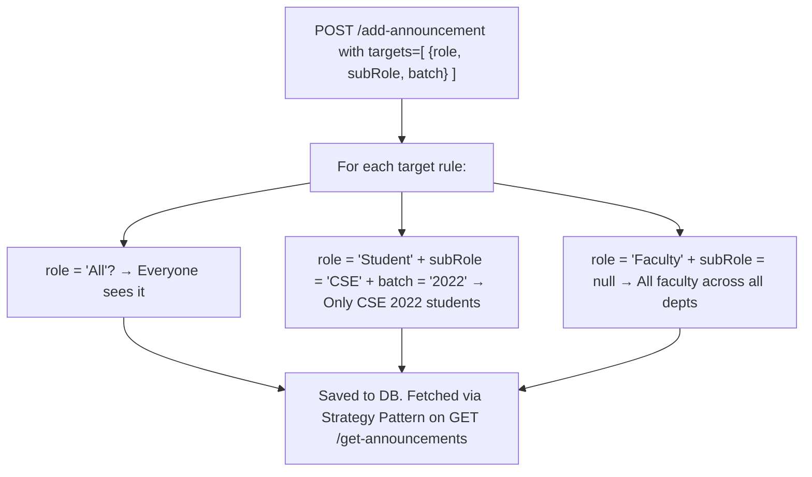

# Content Management — API Contracts

> **Covers:** Announcements, Academic Materials (Shared Documents), and their file handling.
>
> All requests go to `http://localhost:5001`. No `/api` prefix.

---

## 📢 Announcements

Announcements are broadcast messages targeted at specific audiences. The audience is defined as a set of rules — each rule specifies a role, optional department, and optional batch.

### How Audience Targeting Works



---

### `POST /add-announcement`

Create a new announcement. Supports an optional file attachment.

**Content-Type:** `multipart/form-data`

**Form Fields:**

| Field         | Type          | Required | Notes                                                                   |
| ------------- | ------------- | -------- | ----------------------------------------------------------------------- |
| `title`       | String        | ✅       | Announcement heading                                                    |
| `description` | String        | ✅       | Full message body                                                       |
| `user`        | JSON String   | ✅       | The logged-in user object as a stringified JSON: `JSON.stringify(user)` |
| `targets`     | JSON String   | ✅       | Array of audience rules as stringified JSON (see below)                 |
| `file`        | File (Binary) | ❌       | Any attachment (PDF, image, etc.). Max ~10MB.                           |

**`targets` field format (before stringification):**

```json
[
  { "role": "Student", "subRole": "CSE", "batch": "2022-2026" },
  { "role": "Faculty", "subRole": "All" },
  { "role": "All" }
]
```

> [!NOTE]
> `subRole: "All"` means "all departments". It gets stored as `null` in the database. Use `"All"` string when sending.

**How to send from React:**

```javascript
const formData = new FormData();
formData.append("title", "Exam Schedule Released");
formData.append("description", "Final exams start March 10th.");
formData.append("user", JSON.stringify(currentUser));
formData.append(
  "targets",
  JSON.stringify([{ role: "Student", subRole: "All" }]),
);
if (fileInput) formData.append("file", fileInput);

await axios.post("/add-announcement", formData);
```

**Success (200 OK):**

```json
{
  "message": "Announcement uploaded successfully!",
  "announcement": {
    "_id": "64bcd...",
    "title": "Exam Schedule Released",
    "description": "Final exams start March 10th.",
    "uploadedBy": "64abc...",
    "targetAudience": [{ "role": "Student", "subRole": null }],
    "fileId": "64def...",
    "uploadedAt": "2026-03-04T13:30:00.000Z"
  }
}
```

---

### `GET /get-announcements`

Fetch announcements visible to the requesting user. Uses the **Strategy Pattern** internally — the query filter is built differently per role.

**Query Parameters:**

| Param     | Example     | Notes                                                         |
| --------- | ----------- | ------------------------------------------------------------- |
| `role`    | `Student`   | The logged-in user's role                                     |
| `subRole` | `64aabb...` | The user's SubRole ObjectId (from login response `subRoleId`) |
| `id`      | `22CS001`   | The user's login ID                                           |
| `batch`   | `2022-2026` | Required for Students                                         |

**Example URL:**

```
GET /get-announcements?role=Student&subRole=64aabb...&id=22CS001&batch=2022-2026
```

**Success (200 OK):**

```json
{
  "announcements": [
    {
      "_id": "64bcd...",
      "title": "Exam Schedule Released",
      "description": "Final exams start March 10th.",
      "uploadedAt": "2026-03-04T13:30:00.000Z",
      "fileId": {
        "_id": "64def...",
        "fileName": "schedule.pdf",
        "filePath": "1abc...googleDriveId",
        "fileType": "application/pdf",
        "fileSize": 204800
      },
      "uploadedBy": { "username": "Dr. Ramesh", "role": "HOD" }
    }
  ]
}
```

> [!NOTE]
> `fileId` is populated with the full File document. Use `filePath` (a Google Drive File ID or local filename) with `GET /proxy-file/:id` to actually download/view the file.

---

### `DELETE /delete-announcement/:id`

Delete an announcement by its MongoDB `_id`.

**URL Example:** `DELETE /delete-announcement/64bcd...`

**Success (200 OK):** `{ "message": "Announcement deleted successfully" }`

**Error (404):** `{ "message": "Announcement not found" }`

---

## 📚 Shared Academic Materials

Materials are documents shared by Faculty/HOD/Dean with specific audiences. The hierarchy system prevents lower-rank users from sharing upward.

### Role Hierarchy for Sharing

```
Admin (1) → Officers (2) → Dean (3) → Asso.Dean (4) → HOD (5) → Faculty (6) → Student (7)
```

**Rule:** You can only share documents **downward** in the hierarchy. A Faculty member cannot share with a Dean.

---

### `POST /add-material`

Upload a shared document/material.

**Content-Type:** `multipart/form-data`

**Form Fields:**

| Field                 | Type          | Required | Notes                                                  |
| --------------------- | ------------- | -------- | ------------------------------------------------------ |
| `file`                | File (Binary) | ✅       | The document to share                                  |
| `title`               | String        | ✅       | Display name for the material                          |
| `subject`             | String        | ✅       | Subject/category                                       |
| `user`                | JSON String   | ✅       | Stringified logged-in user object                      |
| `targetAudience`      | JSON String   | ✅       | Array of audience rules (same format as announcements) |
| `targetIndividualIds` | JSON String   | ❌       | Array of specific user IDs: `'["22CS001", "22CS002"]'` |

**Example:**

```javascript
formData.append("title", "Week 5 - Databases Slides");
formData.append("subject", "Database Management Systems");
formData.append("user", JSON.stringify(currentUser));
formData.append(
  "targetAudience",
  JSON.stringify([
    { role: "Student", subRole: "64aabb...", batch: "2022-2026" },
  ]),
);
formData.append("file", fileInput);
```

**Success (200 OK):**

```json
{
  "message": "Material uploaded successfully!",
  "material": {
    "_id": "65abc...",
    "title": "Week 5 - Databases Slides",
    "subject": "Database Management Systems",
    "fileId": "64def...",
    "uploadedBy": "64aaa...",
    "uploadedAt": "2026-03-04T09:00:00.000Z"
  }
}
```

**Error (403):**

```json
{ "message": "Permission Denied: You cannot share documents with Deans." }
```

---

### `GET /get-materials`

Fetch materials visible to the requesting user.

**Query Parameters:**

| Param     | Example     | Notes                   |
| --------- | ----------- | ----------------------- |
| `role`    | `Student`   | User's role             |
| `subRole` | `64aabb...` | User's SubRole ObjectId |
| `id`      | `22CS001`   | User's login ID         |
| `batch`   | `2022-2026` | Student's batch         |

**Success (200 OK):**

```json
{
  "materials": [
    {
      "_id": "65abc...",
      "title": "Week 5 - Databases Slides",
      "subject": "DBMS",
      "fileId": {
        "_id": "64def...",
        "fileName": "slides.pdf",
        "fileType": "application/pdf"
      },
      "uploadedBy": { "username": "Dr. Ramesh", "role": "Faculty" },
      "targetAudience": [
        {
          "role": "Student",
          "subRole": { "displayName": "CSE" },
          "batch": "2022-2026"
        }
      ],
      "targetUserDetails": []
    }
  ]
}
```

---

### `POST /copy-shared-to-drive`

Copy a shared material into the user's personal "My Data" drive. This creates an independent copy — deleting the original won't affect the user's copy.

**Content-Type:** `application/json`

**Request Body:**

```json
{
  "materialId": "65abc...",
  "targetFolderId": "64xyz...",
  "userId": "22CS001"
}
```

> [!TIP]
> Set `targetFolderId` to `null` to copy to the root of "My Data".

**Success (200 OK):** `{ "message": "Copied to My Data" }`

---

### `POST /hide-shared-material`

"Soft delete" a shared material — hides it from the user's view without deleting the original.

**Content-Type:** `application/json`

**Request Body:**

```json
{
  "materialId": "65abc...",
  "userId": "22CS001"
}
```

**Success (200 OK):** `{ "message": "Material hidden" }`
