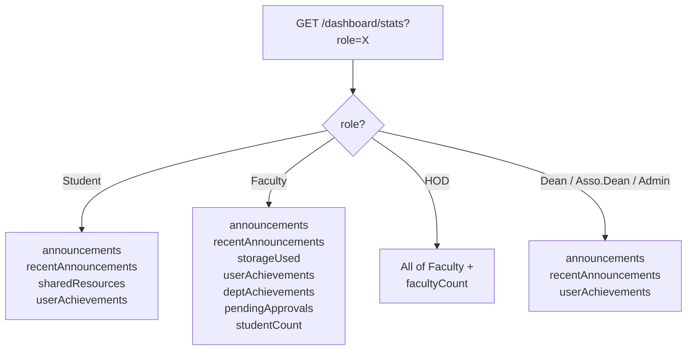

# Dashboard Statistics — API Contract

> **What is this?** The dashboard home screen shows a summary card/widget area. This single endpoint returns all the numbers for those cards — the backend calculates everything in one call, role-aware.

---

## `GET /dashboard/stats`

Fetch role-specific statistics for the logged-in user's dashboard.

**Query Parameters:**

| Param       | Example     | Notes                                                 |
| ----------- | ----------- | ----------------------------------------------------- |
| `role`      | `Student`   | The logged-in user's role                             |
| `subRoleId` | `64aabb...` | User's SubRole ObjectId (fastest lookup — preferred)  |
| `subRole`   | `CSE`       | SubRole name/code (fallback if `subRoleId` not known) |
| `id`        | `22CS001`   | User's login ID                                       |
| `batch`     | `2022-2026` | Required for Students                                 |

**Example URLs:**

```
GET /dashboard/stats?role=Student&subRoleId=64aabb...&id=22CS001&batch=2022-2026
GET /dashboard/stats?role=HOD&subRoleId=64aabb...&id=HOD001
GET /dashboard/stats?role=Faculty&subRoleId=64aabb...&id=FAC001
```

---

## Response Structure (Role-Based)

The response object includes different fields depending on `role`. Fields not relevant to a role are simply absent.



---

### Full Response Reference

**Student Response Example (200 OK):**

```json
{
  "announcements": 14,
  "recentAnnouncements": [
    {
      "_id": "64abc...",
      "title": "Exam Schedule Released",
      "uploadedAt": "2026-03-04T09:00:00.000Z"
    },
    {
      "_id": "64bcd...",
      "title": "Lab Cancelled Today",
      "uploadedAt": "2026-03-03T14:00:00.000Z"
    }
  ],
  "sharedResources": 8,
  "userAchievements": 3
}
```

**Faculty Response Example (200 OK):**

```json
{
  "announcements": 22,
  "recentAnnouncements": [ ... ],
  "storageUsed": 5242880,
  "userAchievements": 5,
  "deptAchievements": 41,
  "pendingApprovals": 6,
  "studentCount": 240
}
```

**HOD Response Example (200 OK):**

```json
{
  "announcements": 22,
  "recentAnnouncements": [ ... ],
  "storageUsed": 10485760,
  "userAchievements": 2,
  "deptAchievements": 72,
  "pendingApprovals": 11,
  "studentCount": 480,
  "facultyCount": 18
}
```

---

### Field Descriptions

| Field                 | Type           | Appears For  | Description                                                 |
| --------------------- | -------------- | ------------ | ----------------------------------------------------------- |
| `announcements`       | Number         | All roles    | Total count of announcements visible to this user           |
| `recentAnnouncements` | Array (max 3)  | All roles    | Last 3 announcements: `{ _id, title, uploadedAt }`          |
| `sharedResources`     | Number         | Student      | Count of materials/documents shared with this student       |
| `storageUsed`         | Number (bytes) | Faculty, HOD | Sum of all file sizes uploaded by this user                 |
| `userAchievements`    | Number         | All roles    | Count of this user's **Approved** achievements              |
| `deptAchievements`    | Number         | Faculty, HOD | Count of **Approved** achievements in the user's dept       |
| `pendingApprovals`    | Number         | Faculty, HOD | Count of **Pending** achievements awaiting approval in dept |
| `studentCount`        | Number         | Faculty, HOD | Total students enrolled in the user's dept                  |
| `facultyCount`        | Number         | HOD only     | Total faculty in the user's dept                            |

> [!TIP]
> `storageUsed` is in bytes. To display as "5.0 MB": `(storageUsed / (1024 * 1024)).toFixed(1) + ' MB'`

---

## Implementation Note

> [!NOTE]
> This endpoint's logic lives inline in `backend/routes/dashboardRoutes.js` (not separated into a controller/service). This is a known architectural debt. When modifying this logic, be careful — it is a single large function handling all roles.
