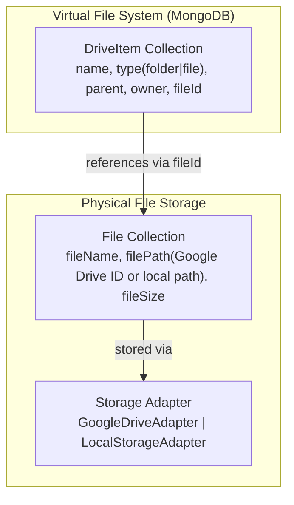

# Personal Drive (My Data) — API Contracts

> **What is My Data?** Every user gets a personal cloud storage area called "My Data". Think of it like a simplified Google Drive nested inside the app. Users can create folders, upload files, move/copy/rename them, and search.

---

## Architecture: Two-Layer Design



- **DriveItem** = the virtual "entry" (what the user sees in the UI: file icon, folder icon, name)
- **File** = the physical file record + storage pointer
- A **folder** DriveItem has no `fileId`. A **file** DriveItem always has a linked `fileId`.

---

## 📁 Folder & File Operations

---

### `GET /drive/items`

List all items in a folder (or the root). Also returns storage used and breadcrumb path.

**Query Parameters:**

| Param      | Required | Notes                                                                 |
| ---------- | -------- | --------------------------------------------------------------------- |
| `userId`   | ✅       | User's login ID (e.g. `22CS001`)                                      |
| `folderId` | ❌       | MongoDB ObjectId of the folder to open. Omit or pass `null` for root. |

**Example:** `GET /drive/items?userId=22CS001&folderId=64abc...`

**Success (200 OK):**

```json
{
  "items": [
    {
      "_id": "64abc...",
      "name": "Semester 5 Notes",
      "type": "folder",
      "parent": null,
      "owner": "64xyz...",
      "itemCount": 12,
      "createdAt": "2026-01-15T10:00:00.000Z"
    },
    {
      "_id": "64bcd...",
      "name": "resume.pdf",
      "type": "file",
      "fileId": {
        "_id": "64def...",
        "fileName": "resume.pdf",
        "fileType": "application/pdf",
        "fileSize": 102400,
        "filePath": "1abc...GoogleDriveFileId"
      }
    }
  ],
  "folder": { "_id": "...", "name": "Semester 5 Notes" },
  "path": [
    { "_id": null, "name": "My Data" },
    { "_id": "64abc...", "name": "Semester 5 Notes" }
  ],
  "storageUsed": 2097152
}
```

> [!TIP]
> `storageUsed` is in bytes. Divide by `1024 * 1024` to get MB. `path` is the breadcrumb trail from root to current folder.

---

### `POST /drive/create-folder`

Create a new folder inside My Data.

**Content-Type:** `application/json`

**Request Body:**

```json
{
  "name": "Semester 5 Notes",
  "parentId": null,
  "userId": "22CS001"
}
```

| Field      | Notes                                                           |
| ---------- | --------------------------------------------------------------- |
| `parentId` | ObjectId of parent folder. Send `null` to create at root level. |

**Success (200 OK):**

```json
{
  "message": "Folder created",
  "folder": {
    "_id": "64abc...",
    "name": "Semester 5 Notes",
    "type": "folder",
    "parent": null
  }
}
```

**Error (400):** `{ "message": "A folder or file with this name already exists in this destination." }`

---

### `POST /drive/upload`

Upload one or more files into My Data.

**Content-Type:** `multipart/form-data`

**Form Fields:**

| Field      | Type                    | Notes                                                           |
| ---------- | ----------------------- | --------------------------------------------------------------- |
| `file`     | File (Binary, multiple) | Attach with field name `file`. Multiple files allowed (max 10). |
| `user`     | JSON String             | Stringified user object: `JSON.stringify(currentUser)`          |
| `parentId` | String                  | Parent folder ObjectId, or `"null"` (string literal) for root   |

```javascript
const formData = new FormData();
formData.append("user", JSON.stringify(currentUser));
formData.append("parentId", selectedFolderId || "null");
fileList.forEach((f) => formData.append("file", f));

await axios.post("/drive/upload", formData);
```

**Success (200 OK):**

```json
{
  "message": "Files uploaded to Drive",
  "items": [
    {
      "_id": "64bcd...",
      "name": "notes.pdf",
      "type": "file",
      "fileId": "64def..."
    }
  ]
}
```

**Error (400):** `{ "message": "File with name \"notes.pdf\" already exists." }`

---

### `PUT /drive/rename/:id`

Rename a file or folder.

**URL:** `PUT /drive/rename/64abc...`

**Content-Type:** `application/json`

**Request Body:** `{ "newName": "Sem5 - Advanced Notes" }`

**Success (200 OK):** `{ "message": "Renamed successfully", "item": { ... } }`

---

### `PUT /drive/move/:id`

Move a file or folder to a different parent folder. Includes circular reference protection.

**URL:** `PUT /drive/move/64abc...`

**Content-Type:** `application/json`

**Request Body:** `{ "newParentId": "64xyz..." }`

> [!NOTE]
> Pass `"newParentId": null` to move to the root.

**Success (200 OK):** `{ "message": "Moved successfully", "item": { ... } }`

**Errors:**
| Message | Cause |
|---|---|
| `"Cannot move a folder into itself."` | Trying to move a folder inside itself |
| `"Cannot move a folder into one of its subfolders."` | Circular reference |
| `"An item with name ... already exists in the destination."` | Name conflict |

---

### `DELETE /drive/delete/:id`

Delete a file or folder. **Folders are deleted recursively** — all nested files and subfolders are permanently deleted.

**URL:** `DELETE /drive/delete/64abc...`

**Success (200 OK):** `{ "message": "Deleted successfully" }`

> [!CAUTION]
> This is **permanent**. There is no trash/recycle bin. The physical file is deleted from storage too.

---

### `GET /drive/folders`

Get a flat list of all folders for the current user. Used to power folder-picker dropdowns (e.g., "Move to..." or "Copy to...").

**Query Parameters:** `?userId=22CS001`

**Success (200 OK):**

```json
{
  "folders": [
    { "_id": "64abc...", "name": "Semester 5 Notes", "parent": null },
    { "_id": "64bcd...", "name": "Databases", "parent": "64abc..." }
  ]
}
```

---

### `POST /drive/copy`

Deep-copy a file or folder (including all nested children) to a new location.

**Content-Type:** `application/json`

**Request Body:**

```json
{
  "itemId": "64abc...",
  "targetParentId": "64xyz...",
  "userId": "22CS001"
}
```

> [!NOTE]
> The copy creates **entirely new physical files** in storage — it's not a pointer/shortcut. Deleting the original won't affect the copy.

**Success (200 OK):** `{ "message": "Copied successfully" }`

---

### `GET /drive/search`

Search for files and folders by name within the user's drive.

**Query Parameters:**

| Param    | Example   |
| -------- | --------- |
| `userId` | `22CS001` |
| `query`  | `notes`   |

**Example:** `GET /drive/search?userId=22CS001&query=notes`

**Success (200 OK):**

```json
{
  "items": [
    {
      "_id": "64bcd...",
      "name": "Sem5 Notes.pdf",
      "type": "file",
      "parent": { "_id": "64abc...", "name": "Semester 5" },
      "fileId": { "fileName": "Sem5 Notes.pdf", "fileType": "application/pdf" }
    }
  ]
}
```

---

## 🔗 File Access (Viewing/Downloading)

---

### `GET /proxy-file/:id`

Stream a file from cloud/local storage for download or in-browser preview.

**URL:** `GET /proxy-file/64def...`

> The `:id` here is the **File document's `_id`** (not the DriveItem ID). You get this from the `fileId` field in the DriveItem response.

**Success:** Streams file bytes directly. The browser will download or display it.

**How to open in a new browser tab (React):**

```javascript
window.open(`http://localhost:5001/proxy-file/${item.fileId._id}`, "_blank");
```

---

## 📦 Legacy Endpoints (Personal Files)

These endpoints predate the Drive folder system and still work for simple file access.

| Endpoint                             | Method | Notes                                                       |
| ------------------------------------ | ------ | ----------------------------------------------------------- |
| `GET /get-personal-files?id=22CS001` | GET    | Flat list of all personal files (no folder structure)       |
| `POST /upload-personal-file`         | POST   | Upload files tagged as personal (legacy, no folder support) |
