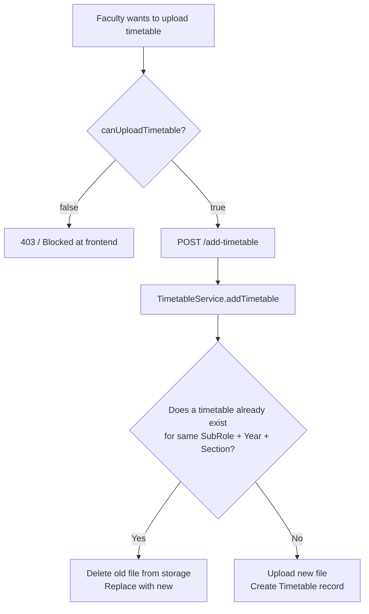

# Timetable & SubRole Management — API Contracts

---

## 📅 Timetables

Timetables are PDF schedules uploaded by permitted Faculty or HODs. Students and Faculty can pin up to 3 timetables to their profile for quick access.

### Permission System



**Who can upload timetables?**

- HODs — always allowed
- Faculty — only if `canUploadTimetable = true` (Admin/HOD grants this via `POST /toggle-timetable-permission`)

---

### `POST /add-timetable`

Upload a timetable PDF. Requires authentication.

**Content-Type:** `multipart/form-data`

🔒 **Requires:** `Authorization: Bearer <token>` header

| Form Field      | Type       | Required | Notes                                                         |
| --------------- | ---------- | -------- | ------------------------------------------------------------- |
| `file`          | File (PDF) | ✅       | Field name must be exactly `"file"`                           |
| `subRole`       | String     | ✅       | Department code/name/ObjectId (e.g. `"CSE"` or `"64aabb..."`) |
| `targetYear`    | Number     | ✅       | Academic year (e.g. `2`)                                      |
| `targetSection` | Number     | ✅       | Section number (e.g. `1`)                                     |
| `batch`         | String     | ❌       | Batch filter e.g. `"2022-2026"`                               |

```javascript
const formData = new FormData();
formData.append("file", selectedFile);
formData.append("subRole", currentUser.subRoleId);
formData.append("targetYear", 2);
formData.append("targetSection", 1);

await axios.post("/add-timetable", formData, {
  headers: { Authorization: `Bearer ${token}` },
});
```

**Success (200 OK):**

```json
{
  "message": "Timetable uploaded successfully",
  "timetable": {
    "_id": "64abc...",
    "targetYear": 2,
    "targetSection": 1,
    "subRole": "64aabb...",
    "fileId": "64def...",
    "uploadedBy": "64xyz...",
    "uploadedAt": "2026-03-04T10:00:00.000Z"
  }
}
```

**Errors:**
| HTTP | Message |
|---|---|
| 400 | `"No file uploaded"` |
| 400 | `"Invalid SubRole: XYZ"` — department not in DB |
| 401 | No/invalid token |

---

### `GET /get-timetables`

Fetch timetables with optional filters.

**Query Parameters:**

| Param     | Example     | Notes                                 |
| --------- | ----------- | ------------------------------------- |
| `subRole` | `64aabb...` | Filter by department ObjectId or name |
| `year`    | `2`         | Filter by target year                 |
| `section` | `1`         | Filter by section                     |

**Example:** `GET /get-timetables?subRole=64aabb...&year=2&section=1`

**Success (200 OK):**

```json
{
  "timetables": [
    {
      "_id": "64abc...",
      "targetYear": 2,
      "targetSection": 1,
      "uploadedAt": "2026-03-04T10:00:00.000Z",
      "fileId": {
        "_id": "64def...",
        "fileName": "CSE_Y2_S1_timetable.pdf",
        "fileType": "application/pdf",
        "fileSize": 512000
      },
      "uploadedBy": { "username": "Dr. Ramesh", "role": "HOD" }
    }
  ]
}
```

---

## 🏢 SubRole (Department) Management

SubRoles represent departments or administrative units (e.g., CSE, AIML, Registrar). They are the backbone of the entire permission and targeting system.

> [!IMPORTANT]
> All SubRole management is **Admin-only**. Never expose these endpoints to other roles in the frontend.

---

### `GET /all-subroles`

Fetch every SubRole in the system. Used to populate department dropdowns in Admin and registration forms.

**No parameters required.**

**Success (200 OK):**

```json
{
  "subRoles": [
    {
      "_id": "64aabb...",
      "name": "Computer Science and Engineering",
      "code": "CSE",
      "displayName": "CSE",
      "allowedRoles": ["Student", "Faculty", "HOD"]
    },
    {
      "_id": "64bbcc...",
      "name": "Artificial Intelligence and Machine Learning",
      "code": "AIML",
      "displayName": "AIML",
      "allowedRoles": ["Student", "Faculty", "HOD"]
    }
  ]
}
```

---

### `GET /subroles/:role`

Fetch SubRoles applicable to a specific role. Used when registering a HOD or Faculty to show only valid departments.

**URL Example:** `GET /subroles/Faculty`

**Success (200 OK):** Same structure as `/all-subroles` but filtered to SubRoles where `allowedRoles` includes the given role.

---

### `POST /add-subrole`

Create a new department/SubRole. Admin only.

**Content-Type:** `application/json`

**Request Body:**

```json
{
  "name": "Computer Science and Engineering",
  "code": "CSE",
  "displayName": "CSE",
  "allowedRoles": ["Student", "Faculty", "HOD", "Asso.Dean"]
}
```

| Field          | Notes                                                               |
| -------------- | ------------------------------------------------------------------- |
| `code`         | Uppercase unique identifier. Used for quick lookup. Must be unique. |
| `displayName`  | Short name shown in the UI                                          |
| `allowedRoles` | Which roles can be registered under this department                 |

**Success (201):** `{ "message": "SubRole created", "subRole": { ... } }`

**Error (400):** `{ "message": "SubRole with this code already exists" }`

---

### `DELETE /delete-subrole/:id`

Delete a SubRole by its MongoDB `_id`. Admin only.

**URL Example:** `DELETE /delete-subrole/64aabb...`

> [!CAUTION]
> Deleting a SubRole does not cascade-delete Users assigned to it. Those users will have a dangling `subRole` reference. Always re-assign or delete users before deleting a SubRole.

**Success (200 OK):** `{ "message": "SubRole deleted" }`
