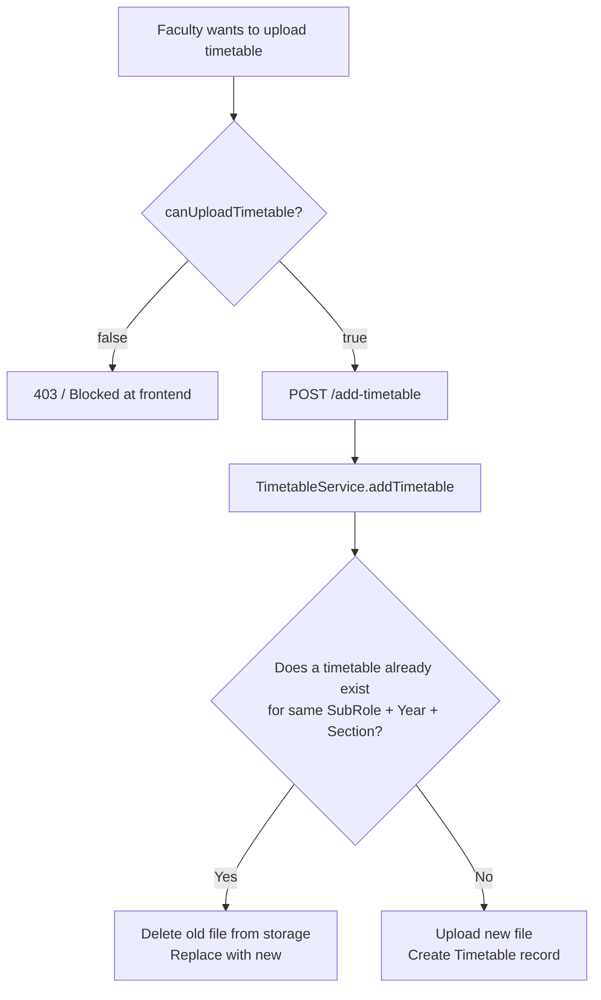

# Timetable Management — API Contracts

Timetables are PDF schedules uploaded by permitted Faculty or HODs. Students and Faculty can pin up to 3 timetables to their profile for quick access.

---

## 📅 Timetable Operations

### Permission System



**Who can upload timetables?**

- HODs — always allowed
- Faculty — only if `canUploadTimetable = true` (Admin/HOD grants this via `POST /toggle-timetable-permission`)

---

### `POST /add-timetable`

Upload a timetable PDF. Requires authentication.

**Content-Type:** `multipart/form-data`

🔒 **Requires:** `Authorization: Bearer <token>` header

| Form Field      | Type       | Required | Notes                                                         |
| --------------- | ---------- | -------- | ------------------------------------------------------------- |
| `file`          | File (PDF) | ✅       | Field name must be exactly `"file"`                           |
| `subRole`       | String     | ✅       | Department code/name/ObjectId (e.g. `"CSE"` or `"64aabb..."`) |
| `targetYear`    | Number     | ✅       | Academic year (e.g. `2`)                                      |
| `targetSection` | Number     | ✅       | Section number (e.g. `1`)                                     |
| `batch`         | String     | ❌       | Batch filter e.g. `"2022-2026"`                               |

---

### `GET /get-timetables`

Fetch timetables with optional filters.

**Query Parameters:**

| Param     | Example     | Notes                                 |
| --------- | ----------- | ------------------------------------- |
| `subRole` | `64aabb...` | Filter by department ObjectId or name |
| `year`    | `2`         | Filter by target year                 |
| `section` | `1`         | Filter by section                     |

**Example:** `GET /get-timetables?subRole=64aabb...&year=2&section=1`

**Success (200 OK):**

```json
{
  "timetables": [
    {
      "_id": "64abc...",
      "targetYear": 2,
      "targetSection": 1,
      "uploadedAt": "2026-03-04T10:00:00.000Z",
      "fileId": {
        "_id": "64def...",
        "fileName": "CSE_Y2_S1_timetable.pdf"
      },
      "uploadedBy": { "username": "Dr. Ramesh", "role": "HOD" }
    }
  ]
}
```

---

### `POST /toggle-timetable-permission`

Grant or revoke a faculty member's ability to upload timetables. HOD/Admin only.

**Request Body:**

```json
{
  "userId": "FAC001",
  "canUpload": true
}
```
