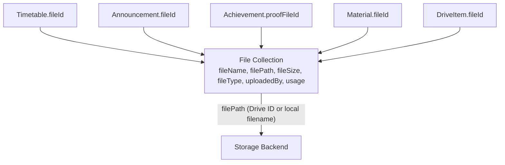

# ADR-0003: Unified File Model for All Upload Contexts

**Status:** Accepted  
**Date:** 2025-12-20  
**Deciders:** Ganesh (Lead), Development Team

---

## Context & Problem

The application handles file uploads from multiple independent features:

- Timetable uploads (department schedules)
- Announcement attachments (broadcast files)
- Achievement proof documents (certificates)
- Material/shared documents (lecture notes)
- Personal Drive files (user-owned arbitrary files)

Each of these was considered a separate "type" of file with different metadata. The naive approach is to store the file path directly inside each feature's document (e.g., `timetable.filePath = "schedule.pdf"`).

---

## Decision

We chose to create a **single shared `File` collection** (model: `models/File.js`). Every upload from any feature creates one `File` document. Feature models reference it via `fileId: ObjectId → File`.



The `File.usage` sub-document flags which context the file belongs to:

```javascript
usage: {
  isPersonal: Boolean,      // DriveItem
  isAnnouncement: Boolean,  // Announcement
  isAchievement: Boolean,   // Achievement proof
  isDeptDocument: Boolean   // Material/Timetable
}
```

---

## Consequences

### ✅ Pros

- **Single source of truth for physical files.** `proxy-file/:id` works for ANY file across ALL features.
- **Easy storage accounting.** Summing all `File.fileSize` per user gives total storage consumed, regardless of what category each file came from.
- **Copy works universally.** `DriveService.copyItem()` calls `storageService.copyFile(filePath)` using the `File` record — no need to know which feature the file came from.
- **Centralized deletion.** When a DriveItem is deleted, the service deletes the `File` record first, which triggers the physical file deletion via the adapter.

### ⚠️ Cons / Tradeoffs

- **Slightly more complex queries.** Fetching a Timetable requires a `.populate('fileId')` to get the actual file metadata.
- **Orphaned records risk.** If a feature document (e.g., Announcement) is deleted without also deleting the `File` record, orphaned File documents accumulate. (Currently there is no cascade-delete enforcement.)
- **`usage` flags can go stale.** If a file is re-used across contexts, the flags may not accurately reflect current usage.

---

## Alternatives Considered

| Option                                                                        | Why Rejected                                                                                                 |
| ----------------------------------------------------------------------------- | ------------------------------------------------------------------------------------------------------------ |
| Store `filePath` as a string directly on each feature model                   | Would make the proxy endpoint impossible — you'd need to know which collection to look in to stream the file |
| Separate file collections per feature (`TimetableFile`, `MaterialFile`, etc.) | Code duplication, separate adapters, and no easy cross-feature copy                                          |
